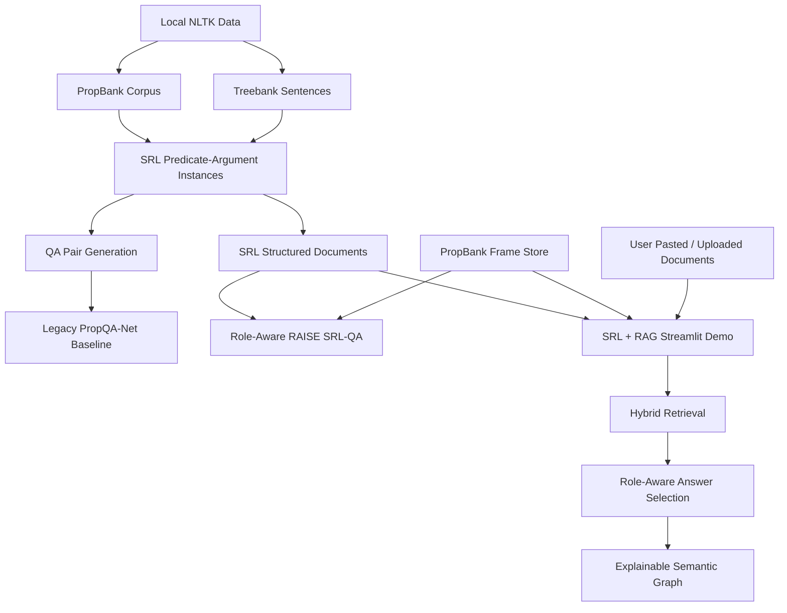
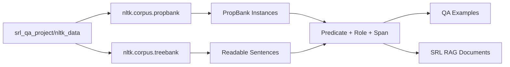
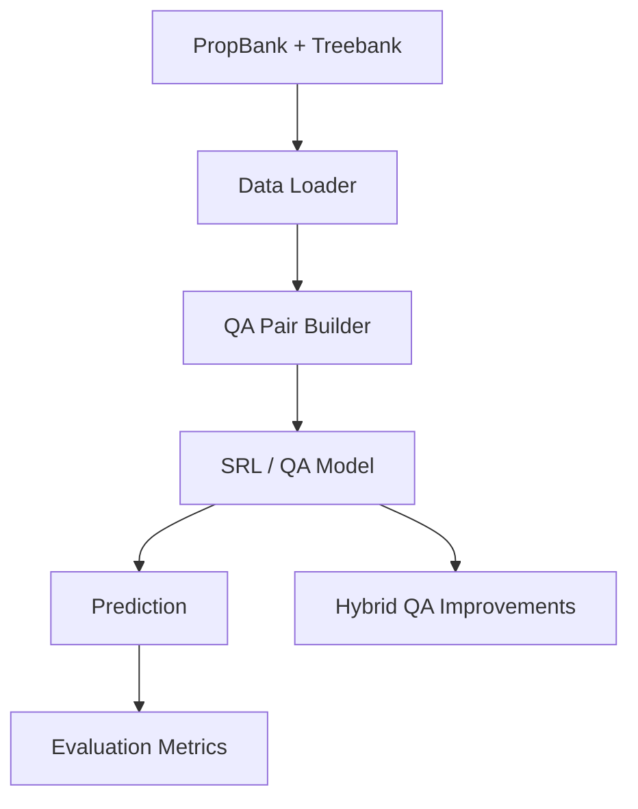
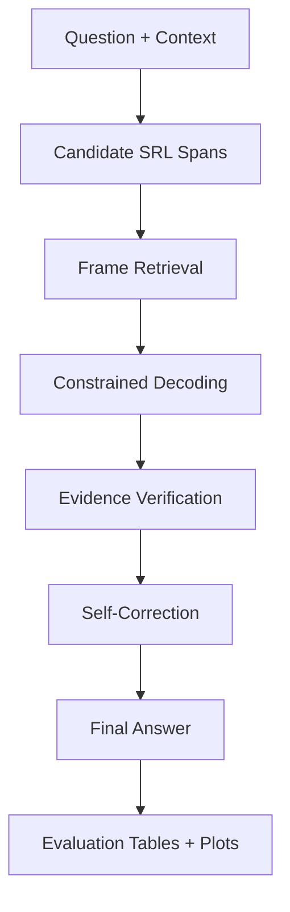
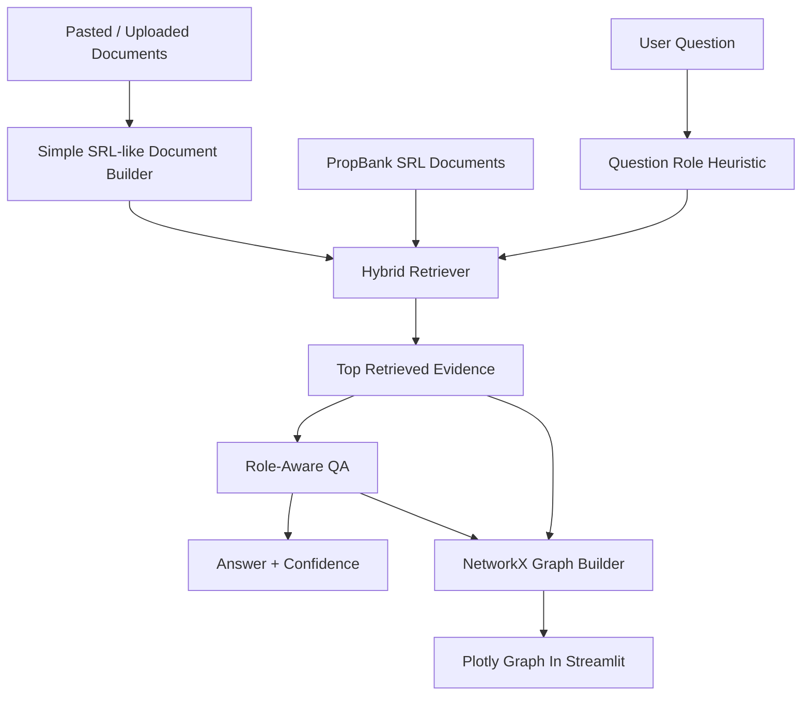
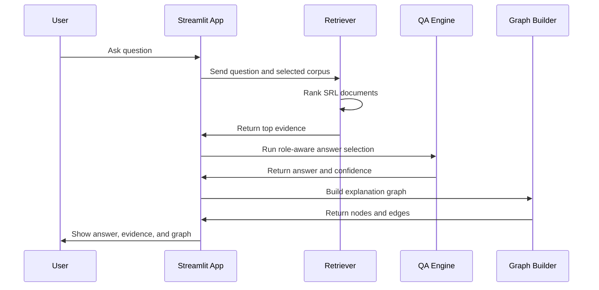
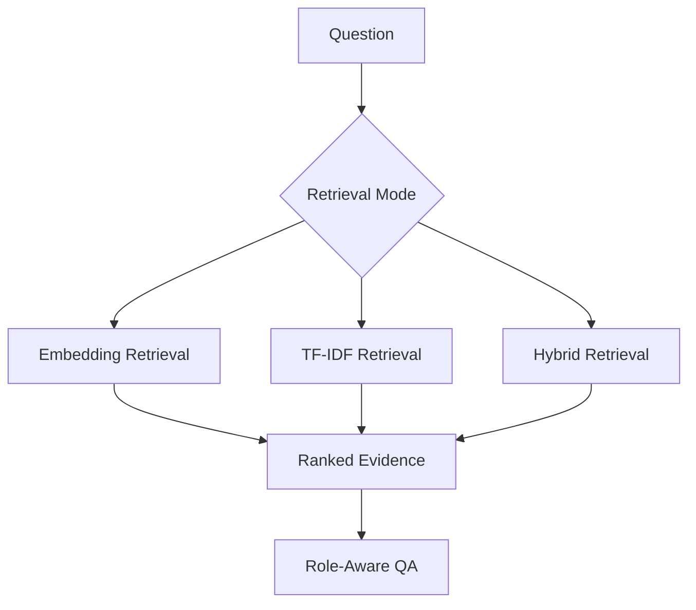
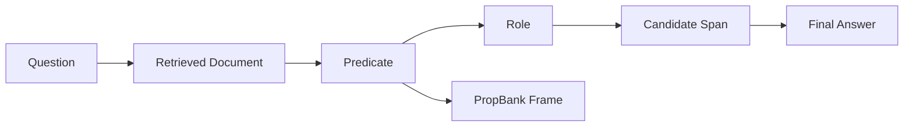

# Architecture And Key Evaluation Metrics

## Purpose

This document explains the complete project architecture in an understandable way and lists the key evaluation metrics used to measure the system.

The project goal is:

```text
Build explainable question answering using Semantic Role Labeling, PropBank, retrieval, and graph-based reasoning.
```

The final project is not just one model. It is a complete workspace with:

- a legacy SRL-QA baseline,
- a newer role-aware SRL-QA framework,
- a standalone SRL + RAG Streamlit demo,
- experiment artifacts,
- evaluation tables and documentation.

## 1. High-Level Architecture



Simple explanation:

```text
PropBank gives the semantic roles.
Treebank helps reconstruct readable sentences.
The project converts those roles into QA examples and SRL documents.
The baseline answers questions from SRL spans.
The newer systems add role-aware retrieval, verification, and graph explanation.
```

## 2. Workspace Architecture

| Folder / File | Architecture Role | Main Use |
|---|---|---|
| `srl_qa_project/` | Legacy baseline system | Original PropQA-Net style SRL + QA pipeline. |
| `srlqa/` | Newer RAISE-SRL-QA framework | Role-aware retrieval, verification, correction, and model comparison. |
| `srl_rag_demo/` | Final standalone demo system | Streamlit SRL + RAG + explainable graph QA app. |
| `propbank_srlqa_artifacts/` | LoRA experiment artifacts | Early extractive QA fine-tuning artifacts. |
| `propbank_srlqa_2b_artifacts/` | QLoRA / generative experiment artifacts | Experimental generative QA artifacts. |
| `RUN_ALL_EXPERIMENTS_DEMO.md` | Runbook | Commands to run the demos and experiments. |
| `PROJECT_EXPLANATION.md` | Project explanation | Formal project overview. |
| `PROJECT_UNDERSTANDING_GUIDE.md` | Beginner guide | Simple explanation of the project. |
| `SURVEY_INNOVATION_IMPLEMENTATION_ANALYSIS.md` | Survey and analysis story | Connects survey, innovation, implementation, analysis, and metrics. |
| `KEY_TERMS_PROJECT_WORK.md` | Glossary and work summary | Explains key terms and what was built. |
| `ARCHITECTURE_AND_EVALUATION_METRICS.md` | This file | Explains system architecture and evaluation metrics. |

## 3. Data Architecture

The data flow begins with the local NLTK corpus.



Key data components:

| Component | Meaning | Project Use |
|---|---|---|
| PropBank instances | Predicate-role annotations | Main SRL data source. |
| Treebank sentences | Parsed readable sentences | Used to reconstruct context text. |
| Predicate | Event or verb | Used to anchor the meaning of the question. |
| Role | Semantic label such as `ARG0` or `ARGM-LOC` | Used to choose answer spans. |
| Span | Text covered by a semantic role | Used as an extractive answer candidate. |
| Frame store | Predicate-specific role definitions | Used for role explanation and graph reasoning. |

Important verified data point:

```text
Local PropBank instances loaded through NLTK: 112,917
```

## 4. Legacy Baseline Architecture: `srl_qa_project`

The legacy system is the original SRL + QA baseline.



Main responsibilities:

- Load PropBank and Treebank data.
- Generate QA examples from SRL roles.
- Train or run the baseline model.
- Evaluate exact match, token F1, and SRL role performance.
- Provide hybrid improvements through role-aware heuristics and optional local model assistance.

Best use in presentation:

```text
Use srl_qa_project to explain the original baseline and full-test-set metrics.
```

## 5. RAISE-SRL-QA Architecture: `srlqa`

The `srlqa` folder is the newer experimental framework.



Main responsibilities:

- Use PropBank frame definitions.
- Select candidate answer spans based on semantic roles.
- Verify whether an answer is extractive and role-compatible.
- Compare baseline, hybrid, fast, and model-assisted pipelines.
- Produce model evaluation summary tables and plots.

Best use in presentation:

```text
Use srlqa to explain the innovation layer: retrieval, verification, correction, and model comparison.
```

## 6. SRL + RAG Demo Architecture: `srl_rag_demo`

This is the final standalone demo app.



Main responsibilities:

- Load PropBank through NLTK.
- Build SRL-structured documents.
- Accept pasted or uploaded user documents.
- Retrieve relevant evidence using embeddings when available and TF-IDF fallback when needed.
- Select answer spans using SRL roles.
- Build explainable graph reasoning paths.
- Display everything in Streamlit.

Best use in presentation:

```text
Use srl_rag_demo for the live demo because it connects SRL, RAG, QA, and explainability.
```

Run command:

```powershell
streamlit run srl_rag_demo\app.py
```

## 7. SRL + RAG Runtime Flow

When a user asks a question in the final demo, the system works like this:



Example:

```text
Context: The courier delivered the package to the office at noon.
Question: Where was the package delivered?
Expected role: ARGM-LOC
Answer: to the office
```

Reasoning path:

```text
Question -> WHERE -> ARGM-LOC -> delivered -> to the office
```

## 8. Retrieval Architecture

The retrieval system is designed to remain usable even on a local CPU machine.



Retrieval modes:

| Mode | Meaning | Benefit |
|---|---|---|
| Embeddings | Uses sentence-transformer vectors when available | Better semantic similarity. |
| TF-IDF | Uses classical sparse text retrieval | Fast, local, reliable fallback. |
| Hybrid | Combines embedding retrieval and TF-IDF behavior | More flexible retrieval path. |

Why this matters:

```text
The demo does not depend on an external API. If embedding models are unavailable, TF-IDF keeps the app functional.
```

## 9. Explainable Graph Architecture

The explanation graph shows why an answer was selected.



Graph node types:

| Node Type | Meaning |
|---|---|
| Question | The user question. |
| Document | Retrieved evidence text. |
| Predicate | Main event or verb. |
| Role | Semantic role such as `ARG0`, `ARG1`, or `ARGM-LOC`. |
| Candidate | Possible answer span. |
| Frame | PropBank frame information. |
| Answer | Final selected answer. |

Graph edge meanings:

| Edge | Meaning |
|---|---|
| Question -> Document | Retrieval match. |
| Document -> Predicate | The document contains the predicate/event. |
| Predicate -> Role | The predicate has this semantic role. |
| Role -> Candidate | The candidate span fills that role. |
| Candidate -> Answer | The candidate was selected as the final answer. |

## 10. Key Evaluation Metrics

### Exact Match / Accuracy

Exact Match measures whether the predicted answer exactly matches the gold answer.

```text
Exact Match = 1 if predicted answer == gold answer, otherwise 0
```

Use:

```text
Best for strict answer correctness.
```

Example:

```text
Gold: to the office
Prediction: to the office
Exact Match: 100%
```

### Token Precision

Token Precision measures how many predicted tokens are correct.

```text
Token Precision = overlapping tokens / predicted tokens
```

Use:

```text
Useful when the predicted answer contains extra words.
```

### Token Recall

Token Recall measures how many gold answer tokens were found.

```text
Token Recall = overlapping tokens / gold tokens
```

Use:

```text
Useful when the predicted answer misses part of the correct answer.
```

### Token F1

Token F1 combines token precision and token recall.

```text
Token F1 = 2 * Precision * Recall / (Precision + Recall)
```

Use:

```text
Best general QA metric when exact match is too strict.
```

### Role Accuracy

Role Accuracy measures whether the system selected the correct semantic role.

```text
Role Accuracy = correct predicted roles / total examples
```

Use:

```text
Important for this project because explainability depends on selecting the right role.
```

Example:

```text
Question: Where was the package delivered?
Expected role: ARGM-LOC
Predicted role: ARGM-LOC
Role Accuracy: correct
```

### SRL Precision

SRL Precision measures how many predicted SRL labels were correct.

```text
SRL Precision = correct predicted SRL labels / predicted SRL labels
```

Use:

```text
Shows whether the model avoids assigning wrong roles.
```

### SRL Recall

SRL Recall measures how many true SRL labels the model found.

```text
SRL Recall = correct predicted SRL labels / true SRL labels
```

Use:

```text
Shows whether the model misses important roles.
```

### SRL F1

SRL F1 combines SRL precision and SRL recall.

```text
SRL F1 = 2 * SRL Precision * SRL Recall / (SRL Precision + SRL Recall)
```

Use:

```text
Best single metric for SRL label quality.
```

### Micro F1

Micro F1 combines all role predictions before computing the score.

Use:

```text
Good for overall system performance, especially when common roles dominate.
```

### Macro F1

Macro F1 computes F1 for each role and then averages across roles.

Use:

```text
Good for checking performance across rare roles, but often lower when many rare roles exist.
```

### BIO Accuracy

BIO Accuracy measures token-level sequence labeling accuracy.

BIO labels:

| Label | Meaning |
|---|---|
| `B-ARG0` | Beginning of an `ARG0` span. |
| `I-ARG0` | Inside an `ARG0` span. |
| `O` | Outside any argument span. |

Use:

```text
Useful for evaluating SRL as a sequence-labeling task.
```

### Confidence

Confidence is the model or heuristic score assigned to an answer.

Use:

```text
Useful for ranking candidate answers, but it should not be treated as accuracy.
```

### Latency

Latency measures how long the system takes to produce an answer.

Use:

```text
Important for live demos and practical usability.
```

### BLEU

BLEU measures token overlap often used in generation tasks.

Use in this project:

```text
Secondary metric in model comparison. Exact Match and Token F1 are more important for extractive QA.
```

## 11. Key Metric Values: Legacy Full-Test Baseline

Source:

```text
srl_qa_project/results/metrics.json
```

Scope:

```text
Full baseline test metrics from the legacy PropQA-Net project.
```

| Metric | Value |
|---|---:|
| QA exact match | 51.84% |
| QA token F1 | 76.12% |
| SRL micro precision | 73.20% |
| SRL micro recall | 69.55% |
| SRL micro F1 | 71.33% |
| SRL macro F1 | 16.19% |
| SRL BIO accuracy | 81.63% |

Best presentation statement:

```text
On the full PropBank-derived baseline test set, the legacy model achieves 51.84% exact match, 76.12% QA token F1, and 71.33% SRL micro F1.
```

## 12. Key Metric Values: RAISE Curated Seed Suite

Source:

```text
srlqa/output/tables/model_evaluation_summary.csv
```

Scope:

```text
challenge_suite_v2, 15 curated examples.
```

| System | Examples | Accuracy / Exact Match | Token F1 | Role Accuracy | Mean Confidence | Mean Latency |
|---|---:|---:|---:|---:|---:|---:|
| Legacy PropQA-Net Baseline | 15 | 20.00% | 55.22% | 33.33% | 47.77% | 207.54 ms |
| Legacy Hybrid | 15 | 66.67% | 82.30% | 93.33% | 65.31% | 495.87 ms |
| RAISE-SRL-QA Fast | 15 | 100.00% | 100.00% | 100.00% | 95.60% | 7.08 ms |
| RAISE-SRL-QA Model | 15 | 100.00% | 100.00% | 100.00% | 95.71% | 1294.63 ms |

Best presentation statement:

```text
On a controlled 15-example role challenge suite, the RAISE fast and model-assisted pipelines reach 100% exact match and 100% role accuracy. This is a curated seed-suite result, not a full-corpus claim.
```

## 13. Key Metric Values: Legacy Benchmark Tracks

Source:

```text
srl_qa_project/results/benchmarks/benchmark_results.json
```

Scope:

```text
20 challenge examples and 60 combined benchmark examples.
```

| Track | Scope | Exact Match | Token F1 | Role Accuracy |
|---|---:|---:|---:|---:|
| Classical baseline | Challenge, 20 examples | 10.00% | 47.01% | 20.00% |
| Heuristic reranker | Challenge, 20 examples | 60.00% | 77.98% | 100.00% |
| Transformer QA assist | Challenge, 20 examples | 60.00% | 77.98% | 100.00% |
| Full hybrid | Challenge, 20 examples | 60.00% | 77.98% | 100.00% |
| Classical baseline | Combined, 60 examples | 8.33% | 36.24% | 28.33% |
| Heuristic reranker | Combined, 60 examples | 33.33% | 53.83% | 73.33% |
| Transformer QA assist | Combined, 60 examples | 33.33% | 53.83% | 73.33% |
| Full hybrid | Combined, 60 examples | 33.33% | 53.83% | 73.33% |

Best interpretation:

```text
Role-aware reranking improves both answer quality and role selection on challenge-style examples compared with the classical baseline.
```

## 14. Key Metric Values: SRL + RAG Demo Smoke Test

Source:

```text
srl_rag_demo/smoke_test.py
```

Verified smoke-test behavior:

| Check | Result |
|---|---|
| PropBank instances loaded | 112,917 |
| Treebank-backed usable instances | 9,353 |
| Built PropBank demo documents | 40 |
| Retrieval backend in smoke test | TF-IDF |
| Demo question | `Where was the package delivered?` |
| Expected answer | `to the office` |
| Predicted answer | `to the office` |
| Predicted role | `ARGM-LOC` |
| Graph nodes | 12 |
| Graph edges | 15 |

Best presentation statement:

```text
The final SRL + RAG demo correctly answers the courier example and builds a graph explanation connecting the question, retrieved document, predicate, role, and answer span.
```

## 15. Key Metric Values: LoRA / QLoRA FAST_DEV Artifacts

Sources:

```text
propbank_srlqa_artifacts/
propbank_srlqa_2b_artifacts/
```

Scope:

```text
Small FAST_DEV implementation experiments.
```

| Experiment | Scope | Exact Match | Token F1 | Interpretation |
|---|---:|---:|---:|---|
| DistilBERT LoRA extractive QA | 8-example FAST_DEV test | 12.50% | 41.51% | Early feasibility run. |
| Tiny-GPT2 / Gemma 2B QLoRA scaffold | 8-example FAST_DEV test | conflicting artifact values | conflicting artifact values | Treat as unstable dev artifact. |

Safe interpretation:

```text
The LoRA and QLoRA folders show experimental implementation work, but final project claims should rely on the full-test legacy metrics, curated RAISE metrics, and verified SRL + RAG demo behavior.
```

## 16. Evaluation Metric Selection Guide

| Question | Best Metric |
|---|---|
| Did the answer exactly match the gold answer? | Exact Match / Accuracy |
| Did the answer partially overlap with the gold answer? | Token F1 |
| Did the system choose the correct semantic role? | Role Accuracy |
| Did the SRL model label roles correctly overall? | SRL Micro F1 |
| Did the SRL model handle rare roles well? | SRL Macro F1 |
| Did the sequence labeler tag tokens correctly? | BIO Accuracy |
| Is the demo fast enough to present live? | Latency |
| Does the model seem certain? | Confidence |

## 17. Recommended Architecture Explanation For Presentation

Use this script:

```text
The project begins with PropBank and Treebank data loaded through NLTK. PropBank gives predicate-argument role annotations, and Treebank helps reconstruct readable sentences. The legacy system uses these annotations to build SRL-based question answering examples and evaluate baseline performance. The newer RAISE-SRL-QA framework adds frame retrieval, role-aware decoding, verification, and correction. Finally, the standalone Streamlit demo turns the same idea into an SRL + RAG application: it retrieves SRL-structured documents, selects an answer using semantic roles, and visualizes the reasoning path as a graph.
```

## 18. Recommended Metrics Explanation For Presentation

Use this script:

```text
We evaluate the project using exact match, token F1, role accuracy, SRL F1, BIO accuracy, confidence, and latency. Exact match measures strict answer correctness, while token F1 gives partial credit for overlapping answer tokens. Role accuracy is especially important because our project is based on semantic role explanations. On the full baseline test set, the legacy model reaches 76.12% QA token F1 and 71.33% SRL micro F1. On controlled role challenge suites, role-aware systems improve answer selection and role accuracy, reaching up to 100% on the curated 15-example RAISE seed suite.
```

## 19. Claim Discipline

Use these rules in reports and presentations:

- Report `51.84% exact match`, `76.12% QA token F1`, and `71.33% SRL micro F1` as the legacy full-test baseline metrics.
- Report the `100.00%` RAISE result only as a controlled 15-example curated seed-suite result.
- Report challenge benchmark results separately from full-test results.
- Report LoRA and QLoRA results only as FAST_DEV implementation experiments.
- Present `srl_rag_demo` as a functional explainability and demo system, not as a full benchmark replacement.

## 20. Final One-Line Summary

```text
The architecture connects PropBank SRL data, role-aware QA, hybrid retrieval, and graph explanations; the evaluation uses exact match, token F1, role accuracy, SRL F1, BIO accuracy, confidence, and latency to show both answer quality and explainability.
```

