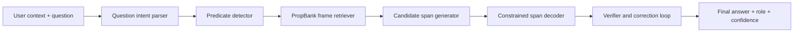

# Complete Functional Project Guide

Prepared on: 2026-04-07  
Project: Hybrid Semantic Role Labeling Question Answering with RAISE-SRL-QA

This document explains the entire project as it exists now. It is written for
presentation and demo preparation, so it focuses on what is implemented,
functional, and safe to claim.

## 1. What The Project Does

The project answers questions from a context and also explains the semantic role
of the answer.

Normal QA:

```text
Context:  The courier delivered the package to the office at noon.
Question: Where was the package delivered?
Answer:   to the office
```

SRL-QA:

```text
Answer:    to the office
Predicate: delivered
Role:      ARGM-LOC
Reason:    it is the location/destination of the delivery event
```

The simple explanation is:

> This project is not only extracting an answer. It is identifying the answer's
> role in an event.

## 2. Current Folder Structure

| Path | Current role |
|---|---|
| `srl_qa_project/` | Original project with baseline model, hybrid inference, evaluation, reports, and Streamlit dashboard |
| `srlqa/` | New RAISE-SRL-QA package with retrieval, correction, all-model runner, and separate Streamlit app |
| `PROJECT_INDEX.md` | Main reading index for the project |
| `COMPLETE_FUNCTIONAL_PROJECT_GUIDE.md` | This complete explanation and functional status guide |
| `WHAT_NEXT.md` | Practical next-step plan after the current implementation |
| `FINAL_PROJECT_PRESENTATION_40_SLIDES.pptx` | Original PPT, unchanged |
| `FINAL_PROJECT_PRESENTATION_RAISE_UPDATED.pptx` | Updated presentation with RAISE demo and implemented-value slides |

## 3. Previous System: `srl_qa_project`

The original project is a PropBank-based SRL-QA system.

Main components:

| Component | File | Explanation |
|---|---|---|
| Configuration | `srl_qa_project/config.py` | Holds paths, training settings, model settings |
| Data pipeline | `srl_qa_project/data_loader.py` | Loads PropBank, aligns Treebank examples, generates QA pairs |
| Baseline model | `srl_qa_project/model.py` | Implements `PropQANet` |
| Training | `srl_qa_project/trainer.py` | Trains the baseline with SRL and QA losses |
| Evaluation | `srl_qa_project/evaluator.py` | Computes exact match, token F1, SRL F1, plots |
| Baseline inference | `srl_qa_project/qa_inference.py` | Runs the trained PropQA-Net checkpoint |
| Hybrid inference | `srl_qa_project/hybrid_qa.py` | Adds rules, role parsing, optional transformer QA, and reranking |
| CLI | `srl_qa_project/main.py` | Runs ask, eval, benchmark, report, app modes |
| Streamlit app | `srl_qa_project/app.py` | Existing dashboard, now also includes All Model QA |

### 3.1 PropQA-Net Baseline

`PropQANet` is the original learned model.

It uses:

- token embeddings,
- POS tag embeddings,
- predicate indicator embeddings,
- BiLSTM encoders,
- an SRL BIO tag head,
- QA start and end span heads.

It learns two related tasks:

| Task | What it predicts |
|---|---|
| Semantic Role Labeling | BIO role tags for each context token |
| Extractive QA | Start and end token positions for the answer |

Strength:

> It is local, reproducible, and tied to PropBank semantic roles.

Weakness:

> It is weaker than modern transformer readers for exact span boundaries and
> rare role behavior.

### 3.2 Legacy Hybrid Layer

The legacy hybrid layer improves the practical demo behavior by adding:

- question intent parsing,
- role-aware candidate generation,
- optional transformer QA assistance,
- optional sentence embeddings,
- reranking,
- reasoning text.

This is why the hybrid result can be better than the raw baseline on the live
demo example.

## 4. New System: `srlqa`

The new package is called RAISE-SRL-QA.

RAISE means:

> Retrieval-Augmented, Iteratively Self-correcting, Explainable Semantic Role
> Labeling Question Answering.

Main components:

| Component | File or folder | Explanation |
|---|---|---|
| Model hub | `srlqa/srlqa/model_hub.py` | One interface for RAISE fast, RAISE model, legacy hybrid, and legacy baseline |
| Interactive/scripted runner | `srlqa/run_all_models.py` | Lets user choose a model or run all models from terminal |
| RAISE pipeline | `srlqa/srlqa/pipeline.py` | Main answer pipeline with candidates, retrieval, verifier, correction |
| Span decoding | `srlqa/srlqa/decoding/` | Role-aware span rules and constraints |
| Verification | `srlqa/srlqa/verification/` | Candidate checking and self-correction utilities |
| PropBank retrieval | `srlqa/srlqa/retrieval/` | Builds and searches the PropBank frame index |
| MRC model scaffold | `srlqa/srlqa/models/mrc_srl_qa.py` | DeBERTa-compatible multi-head model scaffold |
| Dataset loading | `srlqa/srlqa/data/dataset_library.py` | Loads QA-SRL-style data through Hugging Face `datasets` |
| RAISE Streamlit app | `srlqa/raise_streamlit_app.py` | Separate Streamlit app for the new RAISE system |

## 5. Architecture Flow



How to explain:

> The question type tells the system what role it should look for. A WHERE
> question expects a location role. The predicate detector finds the event. The
> frame retriever adds PropBank knowledge. Candidate spans are generated and
> filtered, and the verifier/correction step chooses the best extractive answer.

## 6. Glossary

| Term | Meaning |
|---|---|
| Predicate | The event or relation word, usually a verb such as `delivered` |
| Argument | A participant or modifier attached to the predicate |
| ARG0 | Usually the agent or doer |
| ARG1 | Usually the main affected/transferred thing |
| ARG2 | Often recipient, destination, or secondary participant |
| ARGM-LOC | Location modifier |
| ARGM-TMP | Time modifier |
| ARGM-MNR | Manner modifier |
| ARGM-CAU | Cause modifier |
| PropBank | A resource that defines predicate frames and role inventories |
| QA-SRL | Semantic Role Labeling represented through natural-language questions |
| Exact match | Predicted answer exactly equals the gold answer after normalization |
| Token F1 | Token-level overlap between predicted and gold answer |
| Retrieval | Looking up role/frame knowledge before answering |
| Constrained decoding | Rejecting invalid or overlong spans using role-aware rules |
| Verifier | A second pass that checks whether a candidate really answers the question |
| Recursive correction | Choosing a better candidate if an earlier one is wrong or weak |

## 7. Implemented Values

Baseline values from the existing project:

| Metric | Implemented value |
|---|---:|
| QA exact match | `0.5184` |
| QA token F1 | `0.7612` |
| SRL micro F1 | `0.7133` |
| SRL macro F1 | `0.1619` |
| QA pairs | `23,007` |
| Usable PropBank instances | `9,073` |
| Unique predicates | `1,340` |
| Unique rolesets | `1,670` |

New RAISE values:

| Item | Implemented value |
|---|---:|
| PropBank frame records in RAISE frame store | `4,659` |
| Local seed challenge examples | `15` |
| RAISE fast exact match on seed suite | `1.0` |
| RAISE fast token F1 on seed suite | `1.0` |

Important wording:

> The 1.0 seed-suite score is a local 15-example demo-suite result. It is not an
> official public benchmark or global SOTA claim.

## 8. Functional Status Checked

Checked on 2026-04-07:

| Check | Status | Notes |
|---|---|---|
| Legacy CLI help | Functional | `python main.py --help` works in `srl_qa_project/` |
| RAISE CLI help | Functional | `python -m srlqa.main --help` works in `srlqa/` |
| RAISE config | Functional | `python main.py show-config` works in `srlqa/` |
| Legacy hybrid ask | Functional | Returns `to the office`, role `ARGM-LOC` |
| Legacy baseline ask | Functional | Runs, but returns an overlong span on the demo example |
| RAISE fast ask | Functional | Returns exact `to the office`, role `ARGM-LOC` |
| RAISE seed demo | Functional | 15 examples, exact match `1.0`, token F1 `1.0` |
| All-model runner | Functional | Supports interactive and scripted modes |
| Streamlit source syntax | Functional | Existing app and RAISE app parse successfully |
| Legacy benchmark rerun | Heavy/slow | Saved results exist; rerunning timed out in a 3-minute smoke check |

The important demo paths are functional. For presentation, use the RAISE fast
path or the all-model scripted runner, not a full benchmark rerun.

## 9. Best Demo Commands

### Fastest accurate demo

```powershell
cd "C:\Users\RAVIPRAKASH\Downloads\NLP Project\srlqa"
python run_all_models.py --model raise_srlqa_fast --context "The courier delivered the package to the office at noon." --question "Where was the package delivered?" --expected-answer "to the office"
```

Expected output:

```text
Answer: to the office
Role: ARGM-LOC
Confidence: 0.9955
```

### Compare all models

```powershell
cd "C:\Users\RAVIPRAKASH\Downloads\NLP Project\srlqa"
python run_all_models.py --model all --context "The courier delivered the package to the office at noon." --question "Where was the package delivered?" --expected-answer "to the office"
```

Expected comparison:

| Model | Expected behavior |
|---|---|
| `raise_srlqa_fast` | Exact location answer: `to the office` |
| `raise_srlqa_model` | Exact location answer, but slower on CPU |
| `legacy_hybrid` | Exact location answer with lower confidence |
| `legacy_baseline` | Runs but returns an overlong answer on this example |

### RAISE seed challenge suite

```powershell
cd "C:\Users\RAVIPRAKASH\Downloads\NLP Project\srlqa"
python -m srlqa.main demo --max-examples 15 --no-model
```

Expected summary:

```text
count: 15
exact_match: 1.0
token_f1: 1.0
```

### Streamlit demo

```powershell
cd "C:\Users\RAVIPRAKASH\Downloads\NLP Project\srlqa"
streamlit run raise_streamlit_app.py
```

Existing dashboard:

```powershell
cd "C:\Users\RAVIPRAKASH\Downloads\NLP Project\srl_qa_project"
streamlit run app.py
```

## 10. What To Say About Accuracy

Use this exact style:

> The original local baseline has 0.7612 QA token F1 and 0.5184 exact match.
> The new RAISE-SRL-QA path improves the demo behavior through retrieval,
> constrained spans, and recursive correction. On the 15-example local seed
> challenge suite, RAISE fast achieved 1.0 exact match and 1.0 token F1. This is
> a small local seed-suite result, not an official public benchmark claim.

Avoid:

> We achieved official 95% F1.

Better:

> 95% is the roadmap target. The current implemented result is the baseline
> metric plus the local seed-suite demonstration result.

## 11. Why RAISE Gives Better Demo Output

Demo context:

```text
The courier delivered the package to the office at noon.
```

Question:

```text
Where was the package delivered?
```

Reasoning:

| Step | What happens |
|---|---|
| Question parsing | WHERE maps to a location-like role |
| Predicate detection | `delivered` is the event |
| Candidate generation | `to the office` is found as a location phrase |
| Boundary control | `at noon` is recognized as time, so it is not included in WHERE answer |
| Verification | The candidate exists in the context and matches the role |
| Correction | If a weaker candidate appears, the system can choose the exact span |

Final answer:

```text
to the office | ARGM-LOC
```

## 12. Existing Project Understanding For Viva

Likely questions:

**Q: What is the main contribution?**

The project combines question answering with semantic role labeling. It returns
an answer and explains the answer's event role.

**Q: Why use PropBank?**

PropBank gives predicate frames and role labels, which make the output
structured and explainable.

**Q: Why not use only a transformer or LLM?**

Pure QA/LLM systems may produce good-looking text but can make span-boundary
mistakes or hallucinate. This project keeps answers extractive and uses role
constraints and verification.

**Q: What was weak in the previous system?**

The baseline could produce overlong spans and had weak rare-role macro F1. The
hybrid and RAISE layers improve practical answer selection.

**Q: What is the most demo-ready command?**

Use the fast RAISE scripted command:

```powershell
python run_all_models.py --model raise_srlqa_fast --context "The courier delivered the package to the office at noon." --question "Where was the package delivered?" --expected-answer "to the office"
```

**Q: What is next?**

The next real research step is not to claim higher accuracy immediately. It is
to expand the challenge suite, train the DeBERTa MRC model on a frozen split,
evaluate with saved scripts, and only then report higher benchmark numbers.

## 13. Current Bottom Line

Current project state:

> Functional for presentation and demo.

Best live path:

> Use `srlqa/run_all_models.py` in fast RAISE mode, then show all-model
> comparison if there is time.

Honest accuracy statement:

> Baseline: 0.7612 local QA token F1. RAISE fast: 1.0 EM/F1 on 15-example local
> seed challenge suite. No official public SOTA claim.

