# Final Project Presentation: PropQA-Net & Hybrid SRL-QA System

---

## Slide 1: Title Slide

# Question Answering Using Semantic Roles

### PropQA-Net: A Classical BiLSTM-Based SRL-Anchored QA System
### with Hybrid Inference, Role-Aware Reranking, and Transformer Assist

**NLP Final Project**

---

## Slide 2: Problem Statement

### The Core Problem

Traditional extractive Question Answering (QA) systems return a text span from a context passage but **cannot explain which semantic role that span fills** in the underlying event structure.

For example, given:
> "The chef cooked a delicious meal in the kitchen yesterday."

A standard QA system might answer "the chef" to "Who cooked?" but cannot tell you that this is an **ARG0 (agent)** role, nor can it distinguish between agent, patient, time, location, manner, or cause.

### Our Solution

We reframe QA as **semantic slot filling over PropBank predicate-argument structures**, so that every answer is both extractive and semantically explainable.

---

## Slide 3: Key Objectives

1. **Build a reproducible SRL-QA pipeline** using real PropBank annotations via NLTK
2. **Design PropQA-Net**, a multi-task BiLSTM model that jointly learns SRL tagging and extractive QA
3. **Generate natural-language questions** automatically from PropBank argument roles
4. **Evaluate comprehensively** with EM, token-F1, per-role metrics, and error taxonomy
5. **Upgrade to a hybrid inference system** with role-aware reranking, transformer QA assist, and semantic matching
6. **Benchmark four tracks**: classical baseline, heuristic reranker, transformer QA assist, and full hybrid
7. **Deliver a Streamlit research app** for interactive exploration

---

## Slide 4: System Architecture Overview

```
NLTK PropBank + Treebank (nltk_data/)
            |
            v
  PropBank Instance Alignment + Span Reconstruction
            |
            v
  Example Generation (context, question, answer, SRL BIO tags)
            |
            +--> Cache to data/train.json, val.json, test.json
            |
            v
  Torch DataLoaders + Vocabularies
            |
            v
  PropQA-Net Training (BiLSTM + SRL head + Span heads)
            |
            v
  Evaluation + Plots + Error Analysis
            |
            +--> Baseline Inference Demo
            +--> Hybrid QA + Challenge Benchmarks
            +--> Streamlit Research Website
            +--> PDF Deliverables
```

---

## Slide 5: Data Pipeline

### Source: PropBank via NLTK

- **Total PropBank instances**: Available through NLTK's bundled corpus
- **Usable instances**: Only those aligned to local Penn Treebank parses
- **Filtering rationale**: Deterministic span reconstruction requires Treebank alignment

### Processing Steps

1. Load PropBank instances from `nltk_data/corpora/propbank/`
2. Align each instance with Penn Treebank parse trees
3. Reconstruct sentence text from Treebank leaves
4. Build visible token view (excluding `-NONE-` traces)
5. Assign BIO SRL tags for each argument role
6. Generate natural-language questions from role templates
7. Split deterministically (seed=42): 70% train, 15% val, 15% test

### Question Generation Templates

| Role | Question Pattern |
|------|-----------------|
| ARG0 | "Who {predicate}?" |
| ARG1 | "What did {subject} {predicate}?" |
| ARGM-TMP | "When did {subject} {predicate}?" |
| ARGM-LOC | "Where did {subject} {predicate}?" |
| ARGM-MNR | "How did {subject} {predicate}?" |
| ARGM-CAU | "Why did {subject} {predicate}?" |
| ARG2 | "Who received {object}?" |

---

## Slide 6: PropQA-Net Architecture

### Multi-Task BiLSTM Network

```
Context tokens ----> [Word Embedding (100d)] --\
POS tags ---------> [POS Embedding (32d)] -----+--> [BiLSTM Context Encoder (128h)]
Predicate flags --> [Predicate Emb. (8d)] ----/       |
                                                       v
                                              [Dropout (0.30)]
                                                 /        \
                                                v          v
                                     [SRL BIO Classifier]  [QA Span Projections]
                                                                   |
Question tokens --> [Shared Word Emb.] --> [BiLSTM Question Encoder (128h)]
                                                       |
                                                       v
                                        [Question Vector (mean pooling)]
                                                       |
                                                       v
                                    [Argument-Question Matching Layer]
                                                       |
                                                       v
                                         Best answer span + confidence score
```

### Key Design Choices

- **Shared word embeddings** between context and question encoders
- **Predicate indicator flags** as explicit input features
- **POS tag embeddings** for syntactic grounding
- **Multi-task loss**: alpha * SRL_loss + (1-alpha) * QA_loss
- **Bidirectional LSTMs** for contextual representation

---

## Slide 7: Model Configuration

| Hyperparameter | Value |
|---------------|-------|
| Word embedding dim | 100 |
| POS embedding dim | 32 |
| Predicate embedding dim | 8 |
| Context hidden size | 128 |
| Question hidden size | 128 |
| Dropout | 0.30 |
| Alpha (SRL/QA balance) | 0.50 |
| Batch size | 64 |
| Learning rate | 1e-3 |
| Weight decay | 1e-5 |
| Max epochs | 6 |
| Patience (early stopping) | 5 |
| Gradient clip norm | 5.0 |
| Max sentence length | 128 |
| Max question length | 32 |

---

## Slide 8: Training Procedure

### Loss Function

The model optimizes a weighted multi-task objective:

```
L = alpha * L_SRL + (1 - alpha) * L_QA

L_SRL = CrossEntropy(BIO predictions, gold BIO tags)
L_QA = 0.5 * (CrossEntropy(start_logits, gold_start) + CrossEntropy(end_logits, gold_end))
```

### Training Loop

1. Seed all RNGs (Python, NumPy, Torch) with seed=42
2. For each epoch (max 6):
   - Train on training split with Adam optimizer
   - Evaluate on validation split (loss, EM, token-F1)
   - Save checkpoint if validation F1 improves
   - Early stop if no improvement for 5 epochs
3. Load best checkpoint for final evaluation

### Decoding Strategy

1. Decode BIO spans from SRL predictions
2. Compute cosine similarity between each candidate span and question vector
3. Combine: score = 0.60 * cosine + 0.40 * boundary confidence
4. Select highest-scoring span as final answer
5. Fallback to best boundary span if no clean BIO spans decode

---

## Slide 9: Evaluation Metrics

### QA Metrics

- **Exact Match (EM)**: Predicted answer text equals gold text after normalization
- **Token-overlap F1**: F1 between predicted and gold answer token bags
- **Per-question-type breakdown**: WHO, WHAT, WHEN, WHERE, WHY, HOW

### SRL Metrics

- **Token-level precision/recall/F1** per role (ARG0, ARG1, ARG2, ARGM-TMP, ARGM-LOC, etc.)
- **Macro and micro averages** across all roles
- **BIO accuracy**: Token-level BIO tag classification accuracy
- **Confusion matrix**: Role-to-role confusion patterns

### Error Taxonomy

- Correct predictions
- Predicate misses (predicted role = "O")
- Wrong role predictions
- Span boundary errors (partial overlap)
- Other errors

---

## Slide 10: Hybrid QA System

### Architecture Upgrade

The hybrid system layers multiple inference channels on top of the trained PropQA-Net:

```
Question + Context
       |
       v
  [Question Intent Analyzer]
       |
       v
  [PropQA-Net Baseline] -----> Candidate Span 1
       |
  [Role Heuristics] ---------> Candidate Span 2, 3, 4...
       |
  [Transformer QA (optional)] -> Candidate Span 5, 6, 7...
       |
       v
  [Semantic Reranker]
       |
       v
  [Best Span Selection + Reasoning Trace]
```

### Four Benchmark Tracks

1. **Classical Baseline**: PropQA-Net only
2. **Heuristic Reranker**: Baseline + role-aware heuristics
3. **Transformer QA Assist**: Baseline + transformer span proposals
4. **Full Hybrid**: All channels active with semantic reranking

---

## Slide 11: Hybrid Components

### Question Intent Analyzer

Maps question words to expected SRL roles:

| Question Word | Question Type | Expected Role |
|--------------|--------------|---------------|
| Who | WHO | ARG0 |
| What | WHAT | ARG1 |
| When | WHEN | ARGM-TMP |
| Where | WHERE | ARGM-LOC |
| How | HOW | ARGM-MNR |
| Why | WHY | ARGM-CAU |
| To whom | TO-WHOM | ARG2 |

### Heuristic Evidence Extractors

- **Agent span**: Noun phrase before predicate
- **Theme span**: Noun phrase after predicate
- **Recipient spans**: After "to"/"for" prepositions
- **Temporal spans**: Time markers (days, months, "yesterday", etc.)
- **Location spans**: After location prepositions (in, at, on, near, etc.)
- **Manner spans**: Adverbs ending in "-ly", instrumental phrases
- **Cause spans**: "because", "due to" constructions

### Semantic Reranking

Scores each candidate with weighted features:
- Base score (source confidence): 30%
- Role match score: 32%
- Semantic alignment: 22%
- Lexical overlap: 6%
- Shape bonus: 10%

---

## Slide 12: Challenge Suite

A curated set of diverse QA examples covering all major semantic roles:

| # | Question Type | Target Role | Example Context |
|---|--------------|-------------|-----------------|
| 1 | WHO | ARG0 | "The chef cooked a delicious meal..." |
| 2 | WHEN | ARGM-TMP | "She sent a letter last Monday..." |
| 3 | WHY | ARGM-CAU | "The company announced layoffs because of budget cuts..." |
| 4 | WHAT | ARG1 | "The nurse administered the medicine..." |
| 5 | WHERE | ARGM-LOC | "The courier delivered the package to the office..." |
| 6 | HOW | ARGM-MNR | "The engineer repaired the machine carefully..." |
| 7 | WHAT | ARG1 | "The board approved the proposal..." |
| 8 | TO-WHOM | ARG2 | "Maria gave the intern a notebook..." |
| 9 | WHERE | ARGM-LOC | "Investigators examined the site after the explosion..." |
| 10 | HOW | ARGM-MNR | "The students presented their project enthusiastically..." |

---

## Slide 13: Benchmark Results Summary

### Track Comparison

| Track | Challenge EM | Challenge F1 | Test EM | Test F1 | Mean Latency (ms) |
|-------|-------------|-------------|---------|---------|-------------------|
| Classical Baseline | 0.1000 | 0.4701 | 0.0750 | 0.3086 | 2.89 / 4.49 |
| Heuristic Reranker | 0.6000 | 0.7798 | 0.2000 | 0.4176 | 3.26 / 5.84 |
| Transformer QA Assist | 0.6000 | 0.7798 | 0.2000 | 0.4176 | 285.43 / 290.72 |
| Full Hybrid | 0.6000 | 0.7798 | 0.2000 | 0.4176 | 369.37 / 380.99 |

### Key Findings

- Heuristic reranking improves role-sensitive questions (WHEN, WHERE, WHY)
- Transformer QA provides stronger span proposals for complex contexts
- Semantic reranking improves answer quality and explanation clarity
- Latency trade-off: hybrid components add inference time but improve accuracy

---

## Slide 14: Error Analysis

### Common Error Types

1. **Span Boundary Errors**: Correct role identified but span is too wide/narrow
2. **Wrong Role**: Model assigns incorrect semantic role to answer
3. **Predicate Misses**: Model fails to identify any argument (role = "O")
4. **Ambiguous Contexts**: Multiple valid interpretations of the same sentence

### Error Distribution by Sentence Length

| Length Bucket | Error Rate |
|--------------|------------|
| 0-10 tokens | Low |
| 11-20 tokens | Moderate |
| 21-30 tokens | Higher |
| 31+ tokens | Highest |

### Role-Specific Challenges

- **ARG2 (recipient)**: Often confused with ARG1 (theme)
- **ARGM-CAU vs ARGM-PRP**: Causal vs. purpose modifiers overlap
- **Long modifiers**: Tendency to truncate or over-extend span boundaries

---

## Slide 15: Streamlit Research App

### Features

- **Ask the Model**: Interactive QA with sample questions and custom inputs
- **Architecture**: Visual diagrams of PropQA-Net and hybrid system
- **Dataset Explorer**: PropBank statistics, question-type distribution, role distribution
- **Experiments**: Track comparison, per-question-type metrics, per-role metrics
- **Tradeoffs**: Latency vs. accuracy analysis
- **Documentation**: Full project walkthrough with research anchors
- **Downloads**: Export metrics, benchmarks, and PDF deliverables

### Running the App

```bash
python main.py --mode app --port 8501
```

---

## Slide 16: Reproducibility

### What Makes This Project Reproducible

1. **Bundled NLTK data**: No external corpus downloads required
2. **Deterministic splits**: Fixed random seed (42) for train/val/test
3. **Cached data splits**: JSON files in `data/` directory
4. **Centralized configuration**: All hyperparameters in `config.py`
5. **Checkpoint-based evaluation**: Best model saved and reloadable
6. **Benchmark runner**: Stable, question-type-aware sampling

### Running Modes

```bash
python main.py --mode train      # Train PropQA-Net
python main.py --mode eval       # Evaluate on test set
python main.py --mode infer      # Run inference demo
python main.py --mode ask        # Ask custom questions
python main.py --mode benchmark  # Run four-track benchmark
python main.py --mode report     # Generate PDF deliverables
python main.py --mode app        # Launch Streamlit app
python main.py --mode full       # Run entire pipeline
```

---

## Slide 17: Project Deliverables

### Generated Artifacts

| Artifact | Location | Description |
|----------|----------|-------------|
| best_model.pt | checkpoints/ | Best model checkpoint |
| metrics.json | results/ | SRL + QA evaluation metrics |
| data_statistics.json | results/ | Dataset descriptive statistics |
| benchmark_results.json | results/benchmarks/ | Four-track benchmark results |
| loss_curve.png | results/plots/ | Training/validation loss curves |
| f1_by_argtype.png | results/plots/ | Per-role F1 scores |
| confusion_matrix.png | results/plots/ | SRL role confusion matrix |
| qa_accuracy_by_qtype.png | results/plots/ | EM and F1 by question type |
| answer_length_dist.png | results/plots/ | Predicted vs. gold answer lengths |
| error_taxonomy.png | results/plots/ | Error classification pie chart |
| ablation_summary.png | results/plots/ | Track-level EM and F1 comparison |
| latency_accuracy_tradeoff.png | results/plots/ | Latency vs. F1 scatter plot |
| question_type_heatmap.png | results/plots/ | F1 by question type across tracks |
| role_heatmap.png | results/plots/ | Role accuracy by target role |
| confidence_histogram.png | results/plots/ | Confidence calibration |
| research_architecture.png | results/plots/ | System architecture diagram |
| survey.pdf | outputs/ | Literature survey |
| analysis.pdf | outputs/ | Detailed analysis |
| innovation.pdf | outputs/ | Innovation description |
| research_paper.pdf | outputs/ | Full research paper |
| implementation_code.py | outputs/ | Concatenated source code |

---

## Slide 18: Research Anchors

### Key Literature

1. **Large-Scale QA-SRL Parsing** (ACL 2018)
   - Established large-scale QA-SRL parsing
   - Motivates question-answer supervision over predicate structure

2. **PropBank Comes of Age** (*SEM 2022)
   - Documents modern PropBank resource
   - Semantic backbone for this project

3. **Potential and Limitations of LLMs in Capturing Structured Semantics** (arXiv 2024)
   - Frames where LLM reasoning helps SRL
   - Where deterministic structure is still needed

4. **LLMs Can Also Do Well! Breaking Barriers in SRL via LLMs** (ACL Findings 2025)
   - Recent anchor for LLM-assisted reasoning discussion
   - Future work framing

---

## Slide 19: Strengths and Limitations

### Strengths

- **Explainable answers**: Every answer is tied to a semantic role
- **Reproducible pipeline**: Offline, deterministic, no external downloads
- **Multi-task learning**: SRL and QA share representations
- **Hybrid flexibility**: Classical baseline + modern inference channels
- **Comprehensive evaluation**: EM, F1, role accuracy, error taxonomy, benchmarks

### Limitations

- **Extractive only**: Cannot generate free-form answers
- **BiLSTM-based**: Less powerful than transformer architectures
- **Treebank-dependent**: Limited by local Treebank coverage
- **Heuristic predicate anchoring**: Approximate in raw-text inference
- **Fixed vocabulary**: No subword tokenization or OOV handling

---

## Slide 20: Future Work

### Potential Extensions

1. **Transformer encoder**: Replace BiLSTM with BERT/RoBERTa for richer context
2. **Subword tokenization**: Handle OOV words with WordPiece/BPE
3. **Cross-lingual SRL**: Extend to other languages with PropBank annotations
4. **Multi-hop QA**: Chain multiple predicate-argument structures
5. **LLM-assisted reasoning**: Use instruction models for explanation generation
6. **Real-time streaming**: Deploy as a service API
7. **Active learning**: Select most informative PropBank instances for annotation

---

## Slide 21: Conclusion

### Summary

PropQA-Net demonstrates that **semantic role labeling and question answering can be unified** in a single, interpretable model. By anchoring answers to PropBank predicate-argument structures, we achieve both accuracy and explainability.

The hybrid upgrade shows that **classical NLP pipelines can be enhanced** with modern inference techniques (transformer QA, semantic matching, role-aware reranking) without sacrificing reproducibility.

### Key Takeaway

**Answers are more useful when you know what role they play in the event.**

---

## Slide 22: Demo

### Live Demonstration

```bash
# Ask a custom question
python main.py --mode ask \
  --context "The chef cooked a delicious meal in the kitchen yesterday." \
  --question "Who cooked?"

# Interactive session
python main.py --mode ask --interactive

# Launch the web app
python main.py --mode app
```

### Sample Questions to Try

- "Who cooked?" (ARG0)
- "When did she send?" (ARGM-TMP)
- "Why were layoffs announced?" (ARGM-CAU)
- "What was administered?" (ARG1)
- "Where was the package delivered?" (ARGM-LOC)
- "How did the engineer repair?" (ARGM-MNR)
- "Who received a notebook?" (ARG2)

---

## Slide 23: Repository Structure

```
srl_qa_project/
|-- main.py                 # CLI runner
|-- config.py               # Configuration
|-- data_loader.py          # Data pipeline
|-- model.py                # PropQA-Net
|-- trainer.py              # Training loop
|-- evaluator.py            # Metrics and plots
|-- qa_inference.py         # Inference wrapper
|-- hybrid_qa.py            # Hybrid QA system
|-- benchmark.py            # Benchmark runner
|-- app.py                  # Streamlit app
|-- requirements.txt        # Dependencies
|-- nltk_data/              # NLTK corpora
|-- data/                   # Cached splits
|-- checkpoints/            # Model weights
|-- results/                # Metrics and plots
|-- outputs/                # PDF deliverables
`-- docs/                   # Documentation
```

---

## Slide 24: Q&A

### Thank You

**Questions?**

---

*This presentation covers the complete PropQA-Net project: from PropBank data processing through BiLSTM-based multi-task learning, comprehensive evaluation, hybrid inference upgrade, and interactive research dashboard.*

---

## Slide 25: Extended Segment A

### Detailed Survey and Prior Work Positioning

- This extended segment is designed for the long-form final presentation.
- It expands the earlier concise deck into a clearer academic survey.
- It explains what systems existed before this project.
- It clarifies what had already been achieved in SRL, QA, QA-SRL, transformer QA, and hybrid systems.
- It identifies the gap that our project addresses.
- It sets up the audience to understand why the implementation choices are reasonable.

### What We Will Cover in This Segment

- Semantic role labeling as a linguistic and computational task.
- The historical progression from feature engineering to neural learning.
- The evolution of question answering from retrieval pipelines to extractive readers.
- The bridge created by QA-SRL and role-aware question formulation.
- The shift from pure prediction to explainable and reproducible NLP systems.
- The exact place of PropQA-Net and the hybrid SRL-QA system in this landscape.

### Speaker Notes

- Tell the audience that the survey is not included just to satisfy a report requirement.
- Tell them the survey is necessary because the project sits at the intersection of two major NLP traditions.
- Make it explicit that SRL and QA were often studied separately.
- Explain that our project deliberately combines them.
- Mention that the repository contains a dedicated `DETAILED_SURVEY.md` file and a generated `survey.pdf`.
- Mention that the Streamlit app also contains a literature section, which reinforces the survey narrative.
- Frame the next slides as an answer to one question:
- "Before our system, how were semantic roles and answers handled?"

### Evidence Anchors

- `srl_qa_project/docs/DETAILED_SURVEY.md`
- `srl_qa_project/outputs/survey.pdf`
- `srl_qa_project/app.py`
- `srl_qa_project/docs/DETAILED_INNOVATION.md`

---

## Slide 26: Why Semantic Roles Matter

### Core Idea

- Semantic Role Labeling asks what role each phrase plays around a predicate.
- It goes beyond word matching.
- It tries to explain event structure.
- It answers questions such as:
- Who performed the action?
- What was affected?
- To whom was something given?
- When did the event happen?
- Where did the event happen?
- How did it happen?
- Why did it happen?

### Why This Matters for Question Answering

- A conventional extractive QA system can return a span.
- But a span alone does not explain its semantic function.
- If a sentence contains many candidate spans, role information becomes highly valuable.
- Role information provides interpretability.
- Role information also improves alignment between the question and the answer type.

### Running Example

> The chef cooked a delicious meal in the kitchen yesterday.

- Agent answer: `The chef`
- Theme answer: `a delicious meal`
- Location answer: `in the kitchen`
- Time answer: `yesterday`

### Speaker Notes

- Emphasize that semantic roles are a compact event grammar.
- Tell the audience that PropBank operationalizes this grammar in numbered arguments and modifier labels.
- Explain that our project uses these labels not just as annotations but as supervision signals for question answering.
- This is the first conceptual bridge of the project.
- The answer is not only "what text span?"
- The answer is also "what role does that span play?"

### Evidence Anchors

- `srl_qa_project/docs/DETAILED_SURVEY.md`
- `srl_qa_project/docs/DETAILED_ANALYSIS.md`
- `srl_qa_project/README.md`

---

## Slide 27: Foundations Behind SRL

### Linguistic Foundations

- Frame Semantics motivated the idea that predicates evoke event structures.
- Case Grammar motivated the idea that events have role-bearing participants.
- PropBank turned this linguistic idea into a practical annotation framework.
- Penn Treebank supplied the syntactic backbone.
- PropBank supplied predicate-argument labels anchored to real sentences.

### What PropBank Contributed to the Field

- A predicate-centered representation.
- Consistent role numbering inside each roleset.
- Modifier labels for time, place, manner, cause, and related functions.
- A reusable training resource for SRL systems.
- A bridge between linguistic theory and machine learning practice.

### Why PropBank Is Central to This Project

- The repository is built around local PropBank and Treebank assets under `nltk_data/`.
- The loader explicitly filters for Treebank-backed instances.
- That means the project is not built on synthetic examples alone.
- It is grounded in real corpus annotations.
- This supports reproducibility and semantic rigor.

### Speaker Notes

- Explain that many presentation audiences hear "SRL" and think it is a narrow labeling task.
- Clarify that in our project it acts like a semantic indexing system for answer extraction.
- Tell them that PropBank is the backbone because it provides stable predicate-argument structure.
- Point out that the repository includes corpus assets locally, which is rare in student projects and improves reproducibility.

### Evidence Anchors

- `srl_qa_project/nltk_data/corpora/propbank/`
- `srl_qa_project/nltk_data/corpora/treebank/`
- `srl_qa_project/data_loader.py`
- `srl_qa_project/docs/DATA.md`

---

## Slide 28: Classical SRL Systems

### Before Neural Models

- Early SRL systems were feature-driven.
- They depended heavily on parse trees.
- They used hand-crafted indicators.
- They were usually trained with classic classifiers.

### Typical Feature Families

- Predicate lemma.
- Head word of the candidate argument.
- Position relative to the predicate.
- Syntactic path in the parse tree.
- Phrase type.
- Voice features such as active versus passive.
- Nearby lexical context.
- POS patterns.

### What Those Systems Did Well

- They established SRL as a measurable task.
- They showed that syntax is extremely informative.
- They performed reasonably well on benchmark corpora.
- They created the engineering foundations of later systems.

### What They Struggled With

- Heavy feature engineering burden.
- Dependency on external parsers.
- Difficulty generalizing to unseen forms.
- Pipeline brittleness.
- Significant manual design effort.

### Speaker Notes

- Present classical SRL respectfully.
- It is important to show continuity rather than portraying old systems as "bad."
- The correct framing is:
- they were strong for their time,
- they made the task computationally concrete,
- but they required too much manual structure.
- That limitation is exactly why neural approaches became attractive.

### Evidence Anchors

- `srl_qa_project/docs/DETAILED_SURVEY.md`
- `srl_qa_project/docs/DETAILED_ARCHITECTURE.md`

---

## Slide 29: Neural SRL Systems

### What Changed with Neural Modeling

- Representation learning replaced manual feature engineering.
- BiLSTMs captured bidirectional context.
- Deeper networks captured richer semantics.
- Attention and self-attention improved long-range dependency handling.
- Pretrained language models later pushed performance even further.

### Why Neural SRL Was a Major Step

- It reduced the hand-engineering burden.
- It improved transfer across contexts.
- It made end-to-end or near-end-to-end modeling more practical.
- It aligned better with multi-task learning setups.

### Why This Matters to Our Project

- PropQA-Net intentionally uses a classical-neural middle path.
- It is not a pure feature-engineering system.
- It is not a transformer-heavy architecture either.
- It uses a BiLSTM multi-task design.
- This makes it more explainable and lightweight.
- It is also easier to run offline on a student-project scale.

### Speaker Notes

- Tell the audience the project is not trying to out-compete the biggest pretrained language models.
- It is making a different claim.
- The claim is that a smaller, more reproducible system can still be semantically meaningful and analytically rich.
- That is why the project chooses a BiLSTM backbone and then adds hybrid inference later.

### Evidence Anchors

- `srl_qa_project/docs/DETAILED_SURVEY.md`
- `srl_qa_project/model.py`
- `srl_qa_project/docs/MODEL.md`

---

## Slide 30: Question Answering Before Modern Readers

### Early QA Pipelines

- Traditional QA began as a retrieval-heavy task.
- Systems often used:
- question classification,
- document retrieval,
- passage ranking,
- answer type filtering,
- and surface extraction.

### What Those Systems Did Well

- They scaled to open-domain search settings.
- They handled large document collections.
- They linked NLP with information retrieval.

### What They Did Not Do Well

- They did not deeply model event semantics.
- They rarely explained why an answer span was chosen.
- They often relied on answer-type heuristics more than semantic structure.

### Transition to Reading Comprehension

- The field shifted when machine reading comprehension datasets became standard.
- QA became passage-based rather than purely retrieval-based.
- This made answer span prediction the dominant formulation.

### Speaker Notes

- Explain that the QA field solved a different problem first:
- finding the right document.
- Later it focused on understanding the passage.
- Our project is mainly in the passage-understanding regime.
- But unlike standard extractive QA, we push the model to understand answer roles relative to the predicate.

### Evidence Anchors

- `srl_qa_project/docs/DETAILED_SURVEY.md`
- `srl_qa_project/docs/DETAILED_ANALYSIS.md`

---

## Slide 31: Extractive QA and the SQuAD Era

### The Standard Extractive QA Formulation

- Input:
- a context passage
- and a natural-language question
- Output:
- a contiguous answer span from the context

### Why Extractive QA Became Dominant

- It is easy to evaluate with Exact Match and token-level F1.
- It fits neural architectures naturally.
- It allows large-scale benchmark creation.
- It supports strong span-based inference.

### Strengths of Standard Extractive QA

- High benchmark performance.
- Strong lexical and contextual matching.
- Efficient answer span decoding.
- A very mature evaluation ecosystem.

### Weaknesses Relevant to This Project

- The answer span is semantically unlabeled.
- Two different spans can both look plausible without role guidance.
- The model may rely too much on surface similarity.
- It is not inherently explainable at the event-structure level.

### Speaker Notes

- This is a key contrast slide.
- Tell the audience that standard extractive QA is strong but incomplete for semantically structured questions.
- Our project does not reject extractive QA.
- It enriches extractive QA with semantic-role awareness.
- That is a better framing than saying "we replaced QA."

### Evidence Anchors

- `srl_qa_project/docs/DETAILED_SURVEY.md`
- `srl_qa_project/evaluator.py`
- `srl_qa_project/results/metrics.json`

---

## Slide 32: The QA-SRL Bridge

### Why QA-SRL Was Important

- QA-SRL showed that semantic roles can be represented as question-answer pairs.
- This made semantic structure more intuitive.
- It gave role supervision a natural-language interface.

### Conceptual Importance

- It connected SRL and QA rather than treating them as unrelated tasks.
- It made roles accessible to non-specialists.
- It opened a path toward role-aware supervision and evaluation.

### How Our Project Relates to QA-SRL

- We use the QA-SRL insight that roles can be expressed through questions.
- But we anchor the questions in PropBank-derived arguments.
- We generate template-based questions from real roles.
- We jointly learn SRL tagging and answer span prediction.
- We therefore combine role structure and extractive answering in one training pipeline.

### Speaker Notes

- This slide should make the audience say:
- "Now I understand the idea."
- A role can be seen as the answer to the right question.
- Our system operationalizes that with PropBank-backed data and a multi-task network.
- This is cleaner than a purely heuristic conversion from text to questions because the supervision is corpus-grounded.

### Evidence Anchors

- `srl_qa_project/docs/DETAILED_SURVEY.md`
- `srl_qa_project/data_loader.py`
- `srl_qa_project/docs/DETAILED_INNOVATION.md`

---

## Slide 33: Transformer QA Systems

### What Transformer QA Changed

- Stronger contextual encoding.
- Better long-distance dependency handling.
- Better performance on extractive QA benchmarks.
- Easier transfer through pretraining.

### Why Transformers Are Relevant Here

- The hybrid layer optionally uses a local transformer QA pipeline.
- That means the project does not ignore modern QA.
- Instead it treats modern QA as one candidate source among several.

### Why We Did Not Make the Whole Project Transformer-Only

- The project goal includes explainability and reproducibility.
- Full transformer dependence increases runtime and environment complexity.
- A fully transformer-centered project would blur the contribution of explicit role modeling.
- The repository aims to remain runnable offline and analyzable by module.

### Speaker Notes

- Say this clearly:
- the project is not anti-transformer.
- It is selective about where transformers help.
- In our architecture they help during inference as optional external support.
- The semantic backbone remains the structured SRL-QA system.

### Evidence Anchors

- `srl_qa_project/hybrid_qa.py`
- `srl_qa_project/benchmark.py`
- `srl_qa_project/docs/DETAILED_SURVEY.md`

---

## Slide 34: LLMs and Structured Semantics

### What Large Language Models Add

- Broad language competence.
- Better paraphrase tolerance.
- Stronger zero-shot and instruction-following behavior.
- Potentially richer explanation generation.

### What LLMs Still Do Not Automatically Solve

- Stable symbolic role assignments.
- Reproducible deterministic reasoning traces.
- Lightweight offline deployment.
- Straightforward metric alignment with corpus-based role labels.

### Project Position on LLMs

- The repo literature list acknowledges the rise of LLM-based SRL research.
- The hybrid system includes optional local reasoning support.
- But the core answer path remains deterministic and inspectable.
- This preserves traceability.
- This is especially important in academic demonstration settings.

### Speaker Notes

- This slide is useful if the audience asks:
- "Why not just use GPT or another large model?"
- The answer is:
- because this project studies structured semantics, local reproducibility, and inspectable reasoning.
- Those are strengths of a hybrid, not purely generative, architecture.

### Evidence Anchors

- `srl_qa_project/app.py`
- `srl_qa_project/hybrid_qa.py`
- `srl_qa_project/docs/DETAILED_SURVEY.md`
- `srl_qa_project/docs/DETAILED_INNOVATION.md`

---

## Slide 35: Explainability and Reproducibility

### Why This Matters in NLP Projects

- High benchmark scores alone are not enough for a convincing final project.
- The audience also wants to know:
- What data was used?
- How were examples created?
- What reasoning path was followed?
- Which components can be inspected?
- Which results can be reproduced?

### How Earlier Systems Commonly Fell Short

- Feature systems were often brittle.
- Large neural systems were often opaque.
- Transformer systems could be accurate but computationally heavy.
- Fully black-box answerers made semantic inspection difficult.

### What Our Project Adds

- Local corpus assets.
- Deterministic split generation.
- Explicit configuration files.
- Saved metrics and plots.
- Generated PDF deliverables.
- A hybrid reranker with visible feature components.
- Short reasoning summaries for predictions.

### Speaker Notes

- This is a major positioning slide.
- Explain that the project is not only an NLP model.
- It is a research package.
- That is why the repository includes docs, plots, benchmark outputs, and PDF artifacts.
- This makes the presentation stronger because every claim can be traced to an artifact.

### Evidence Anchors

- `srl_qa_project/config.py`
- `srl_qa_project/results/`
- `srl_qa_project/outputs/`
- `srl_qa_project/docs/`

---

## Slide 36: Prior Work Matrix I

### Comparative Literature View

| Era | System Family | Main Idea | Strength | Limitation | Relation to Our Work |
|-----|---------------|-----------|----------|------------|----------------------|
| Classical SRL | Parse-feature SRL | Use syntax-heavy features for argument identification and classification | Strong linguistic grounding | High feature engineering cost | Motivates our use of explicit semantic roles |
| Classical SRL | Pipeline SRL | Predicate detection, argument detection, then role classification | Modular and interpretable | Error propagation across stages | Our project keeps interpretability but learns jointly |
| Neural SRL | BiLSTM SRL | Learn contextual representations instead of manual rules | Better generalization | Still task-specific and role-only | Inspires our BiLSTM backbone |
| Neural SRL | Deep stacked SRL | Use deeper recurrent networks for better semantic representation | Stronger context modeling | Harder to analyze step by step | We choose a lighter architecture |
| Attention SRL | Self-attentive SRL | Capture long-range dependencies through attention | Better complex-sentence handling | Adds architectural complexity | Hybrid layer partly compensates at inference time |
| Pretrained SRL | BERT-style SRL | Fine-tune large pretrained encoders for SRL | High benchmark performance | Higher compute and lower transparency | We treat this as a reference direction, not the core backbone |
| Early QA | IR pipeline QA | Retrieve documents and extract likely answers | Scales to open-domain settings | Weak sentence-level semantic structure | Our task is passage-level and role-aware |
| Extractive QA | Span readers | Predict start and end positions directly from context | Mature evaluation and high utility | Answer span has no explicit semantic role | Our project directly addresses this limitation |

### Speaker Notes

- Walk through the table row by row.
- Do not rush this table.
- Use it to show that our project borrows strengths from multiple traditions.
- The deck should communicate synthesis, not isolation.

### Evidence Anchors

- `srl_qa_project/docs/DETAILED_SURVEY.md`
- `srl_qa_project/docs/DETAILED_ANALYSIS.md`

---

## Slide 37: Prior Work Matrix II

### Comparative Literature View Continued

| Area | Representative Direction | What It Achieved | What It Did Not Solve | What Our Project Keeps | What Our Project Adds |
|------|--------------------------|------------------|-----------------------|------------------------|-----------------------|
| QA-SRL | Question-answer supervision over semantic roles | Made roles intuitive and question-centered | Did not necessarily unify SRL and extractive QA in one lightweight repo | Role-to-question intuition | Joint SRL plus QA learning from PropBank-derived examples |
| Transformer QA | Powerful pretrained span extraction | Strong answer selection | Little role transparency by default | Strong span proposal as optional support | Role-aware reranking over candidate spans |
| Hybrid QA | Combine neural and heuristic channels | Better robustness in some cases | Often ad hoc and hard to interpret | Multi-source candidate generation | Weighted semantic reranking with explicit role match features |
| Explainable QA | Produce rationales or supporting evidence | Better user trust | Often not tied to predicate-argument semantics | Need for visible reasoning | Deterministic reasoning summary and evidence spans |
| Reproducible NLP pipelines | Save configs, splits, plots, reports | Better research discipline | Often not integrated with semantic QA | Artifact-centered workflow | End-to-end student-project reproducibility from data to PDFs |
| Interactive research demos | Web-based showcasing of results | Better communication and usability | Sometimes disconnected from model internals | Interactive delivery | Streamlit app connected to benchmark outputs and hybrid predictions |

### Speaker Notes

- This slide is extremely useful during viva or defense-style questioning.
- It lets you answer:
- "What exactly is new here?"
- The answer is not that each component is individually unprecedented.
- The answer is that the integration is coherent, grounded, and analyzable.

### Evidence Anchors

- `srl_qa_project/app.py`
- `srl_qa_project/hybrid_qa.py`
- `srl_qa_project/benchmark.py`
- `srl_qa_project/docs/DETAILED_INNOVATION.md`

---

## Slide 38: Gap Analysis

### Gap 1

- Standard extractive QA returns spans.
- It does not naturally tell us the role of those spans.

### Gap 2

- Standard SRL predicts roles.
- It does not naturally answer user questions in a question-answer interface.

### Gap 3

- Heavy transformer systems can be strong.
- But they are not always ideal for lightweight, offline, reproducible projects.

### Gap 4

- Many research demos report metrics.
- Fewer provide a complete package:
- docs,
- local data assets,
- plots,
- benchmark comparisons,
- PDFs,
- and an interactive app.

### Gap 5

- Prior systems usually optimize one axis strongly:
- either accuracy,
- or structure,
- or usability,
- or interpretability.
- This project aims for a balanced combination of all four.

### Speaker Notes

- Say that the project was designed by asking:
- "What is missing if we look at the field from a final-project perspective?"
- The answer is:
- a semantically grounded,
- understandable,
- reproducible,
- demo-ready SRL-QA system.

### Evidence Anchors

- `srl_qa_project/docs/DETAILED_SURVEY.md`
- `srl_qa_project/docs/DETAILED_INNOVATION.md`
- `srl_qa_project/README.md`

---

## Slide 39: Positioning of This Work

### One-Sentence Positioning

PropQA-Net is a reproducible semantic role-anchored QA system that joins corpus-based SRL supervision, extractive answer prediction, and role-aware hybrid inference in one research-oriented repository.

### How to Describe It in the Presentation

- It is not just an SRL tagger.
- It is not just an extractive QA model.
- It is not just a benchmark dashboard.
- It is an integrated SRL-QA research package.

### What Earlier Systems Usually Did

- Prior SRL systems primarily labeled roles.
- Prior QA systems primarily extracted spans.
- QA-SRL systems reframed roles as questions.
- Transformer readers improved span quality.
- Hybrid systems improved robustness.

### What This Project Does

- Uses PropBank-backed role supervision.
- Converts arguments into questions.
- Learns SRL and QA jointly.
- Adds a hybrid inference layer.
- Adds benchmark comparisons.
- Adds figure generation and PDF deliverables.
- Adds a Streamlit app for presentation and exploration.

### Transition to the Next Segment

- After surveying the field, we now move from "what existed before" to "what was actually built in this repository."
- The next segment is implementation-focused.
- It will reference the actual files, modules, statistics, plots, and outputs inside the folder.

### Evidence Anchors

- `srl_qa_project/README.md`
- `srl_qa_project/docs/OVERVIEW.md`
- `srl_qa_project/docs/DETAILED_ARCHITECTURE.md`
- `srl_qa_project/docs/DETAILED_ANALYSIS.md`

---

## Slide 40: Extended Segment B

### Implementation Overview

- This segment moves from research context to repository evidence.
- It is based on the actual files inside the project folder.
- It explains how the project is organized.
- It shows how data becomes questions and answers.
- It shows how the model is trained.
- It shows how the hybrid system extends the baseline.
- It shows how the final artifacts are produced.

### Why This Segment Matters

- Many presentations stay conceptual.
- This segment proves that the project is implemented end to end.
- It also helps the audience connect the codebase to the reported outputs.

### Files Consulted for This Segment

- `srl_qa_project/README.md`
- `srl_qa_project/config.py`
- `srl_qa_project/data_loader.py`
- `srl_qa_project/model.py`
- `srl_qa_project/trainer.py`
- `srl_qa_project/evaluator.py`
- `srl_qa_project/qa_inference.py`
- `srl_qa_project/hybrid_qa.py`
- `srl_qa_project/benchmark.py`
- `srl_qa_project/app.py`
- `srl_qa_project/results/data_statistics.json`
- `srl_qa_project/results/metrics.json`
- `srl_qa_project/results/benchmarks/benchmark_results.json`
- `srl_qa_project/outputs/survey.pdf`
- `srl_qa_project/outputs/analysis.pdf`
- `srl_qa_project/outputs/innovation.pdf`
- `srl_qa_project/outputs/research_paper.pdf`

### Speaker Notes

- Tell the audience that everything from here onward is repository-backed.
- This is not generic NLP commentary.
- It is a guided reading of the project as implemented.
- That makes the presentation stronger and easier to defend.

---

## Slide 41: Folder-Level Evidence Map

### Top-Level Project View

| Folder or File | What It Contains | Why It Matters for the Presentation |
|----------------|------------------|-------------------------------------|
| `README.md` | Outer project launcher note | Shows how the downloaded folder should be used |
| `FINAL_PROJECT_PRESENTATION.md` | This growing presentation deck | Final presentation artifact in Markdown |
| `srl_qa_project/README.md` | Project overview and command reference | Best single entry point into the repo |
| `srl_qa_project/docs/` | Survey, architecture, analysis, innovation, and guides | Supplies long-form project explanation |
| `srl_qa_project/data/` | Cached train, validation, and test splits | Evidence that examples were materialized and reused |
| `srl_qa_project/results/` | Metrics, statistics, benchmark payloads, and plots | Core result evidence |
| `srl_qa_project/outputs/` | PDFs and implementation bundle | Submission-oriented final deliverables |
| `srl_qa_project/nltk_data/` | PropBank and Treebank assets | Makes the project locally reproducible |
| `srl_qa_project/checkpoints/` | Best trained model checkpoint | Evidence that training completed and a model was saved |

### Key Presentation Message

- The repo is organized like a research package, not a single script.
- That matters because the final presentation must show not only a model, but also process and evidence.

### Speaker Notes

- Mention that the included `nltk_data` directory is especially important.
- Without local semantic resources, the project would be much harder to reproduce in an offline classroom environment.
- Also mention that the outputs folder proves the reporting pipeline was completed.

### Evidence Anchors

- `README.md`
- `srl_qa_project/README.md`
- `srl_qa_project/outputs/`
- `srl_qa_project/results/`

---

## Slide 42: Core Module Matrix

### Main Python Modules and Their Roles

| File | Responsibility | Presentation Use |
|------|----------------|------------------|
| `main.py` | CLI entry point for train, eval, infer, ask, benchmark, report, and app modes | Shows the project runs as a complete pipeline |
| `config.py` | Paths and hyperparameters in dataclasses | Good slide for reproducibility and setup |
| `data_loader.py` | PropBank to QA examples, statistics, and DataLoaders | Essential for dataset and methodology slides |
| `model.py` | PropQA-Net architecture | Core implementation slide |
| `trainer.py` | Optimization loop and checkpoint logic | Training procedure slide |
| `evaluator.py` | Metrics, plots, confusion matrix, error analysis | Results section backbone |
| `qa_inference.py` | Baseline inference interface | Baseline system explanation |
| `hybrid_qa.py` | Role-aware reranking and optional local models | Innovation and comparison slides |
| `benchmark.py` | Four-track evaluation and additional plots | Comparative analysis section |
| `app.py` | Streamlit research website | Demo and usability slide |

### Presentation Guidance

- Use this table when the faculty asks "which file does what?"
- It is also a good transition slide before explaining the data pipeline.

### Speaker Notes

- Do not read this table mechanically.
- Point out that the repo is modular by research function:
- data,
- model,
- training,
- evaluation,
- inference,
- benchmarking,
- presentation interface.
- That makes the entire workflow easier to trace.

### Evidence Anchors

- `srl_qa_project/main.py`
- `srl_qa_project/config.py`
- `srl_qa_project/data_loader.py`
- `srl_qa_project/model.py`
- `srl_qa_project/benchmark.py`

---

## Slide 43: Command Flow Through `main.py`

### Supported Modes

- `train`
- `eval`
- `infer`
- `ask`
- `full`
- `app`
- `benchmark`
- `report`

### Why This Matters

- The project is not a one-shot notebook.
- It supports a structured workflow.
- Data preparation is triggered when needed.
- Training is separated from evaluation.
- Benchmarks are separated from baseline metrics.
- Reporting is separated from app deployment.

### Strong Presentation Point

- A modular command-line interface reflects maturity.
- It suggests the project was built for repeatability, not just for screenshots.

### Speaker Notes

- Emphasize that `main.py` orchestrates the full lifecycle.
- The `full` mode can generate the whole pipeline.
- The `benchmark` mode evaluates the hybrid extension.
- The `report` mode regenerates the final PDF deliverables.
- The `app` mode launches the demo site.

### Evidence Anchors

- `srl_qa_project/main.py`
- `srl_qa_project/README.md`

---

## Slide 44: Data Source and Filtering Logic

### Actual Data Source

- Total PropBank instances visible locally: `112,917`
- Usable PropBank instances after Treebank alignment: `9,073`
- Final QA pairs produced: `23,007`
- Unique predicates: `1,340`
- Unique rolesets: `1,670`

### Why the Usable Count Is Lower

- Not every PropBank instance can be aligned to the local Treebank subset.
- The loader keeps only Treebank-backed examples.
- That ensures deterministic token reconstruction.
- That also makes answer spans reliable.

### Presentation Interpretation

- The filtering step is not a weakness.
- It is a quality-control decision.
- It trades raw quantity for reliable span supervision.

### Speaker Notes

- This is a very important defense point.
- If someone asks why only a subset was used, the answer is simple:
- answer boundaries must match the exact local parse-backed tokenization.
- Otherwise the generated QA dataset would become noisy or inconsistent.

### Evidence Anchors

- `srl_qa_project/results/data_statistics.json`
- `srl_qa_project/data_loader.py`
- `srl_qa_project/docs/DATA.md`

---

## Slide 45: How `data_loader.py` Builds Examples

### Pipeline Stages in the Loader

1. Register the local NLTK data path.
2. Read PropBank instances.
3. Filter to locally reconstructable Treebank-backed examples.
4. Build the visible token view and ignore `-NONE-` traces.
5. Resolve PropBank pointers to visible token indices.
6. Convert argument spans into BIO labels.
7. Generate natural-language questions from roles.
8. Create context-question-answer examples.
9. Split deterministically into train, validation, and test.
10. Cache the results in JSON.

### Why This Is Strong

- The pipeline is explicit.
- Each stage can be explained in the presentation.
- Each stage is anchored in code.
- Each stage leaves artifacts or statistics behind.

### Speaker Notes

- The audience should feel that the project is procedurally sound.
- The loader is where most of that confidence comes from.
- It ties linguistic annotation, question generation, and supervision creation together.

### Evidence Anchors

- `srl_qa_project/data_loader.py`
- `srl_qa_project/docs/DETAILED_ARCHITECTURE.md`
- `srl_qa_project/results/data_statistics.json`

---

## Slide 46: Question Generation Logic

### Key Templates Used in Code

| Role | Template Pattern |
|------|------------------|
| `ARG0` | `Who {predicate_surface}?` |
| `ARG1` with subject | `What did {subject} {predicate}?` |
| `ARGM-TMP` | `When did {subject} {predicate}?` |
| `ARGM-LOC`, `ARGM-DIR`, `ARGM-GOL` | `Where did {subject} {predicate}?` |
| `ARGM-MNR`, `ARGM-ADV`, `ARGM-EXT` | `How did {subject} {predicate}?` |
| `ARGM-CAU`, `ARGM-PRP`, `ARGM-PNC` | `Why did {subject} {predicate}?` |
| `ARG2` with description | `What was the {description} in the event where {subject} {predicate}?` |
| Other fallback | `What was the {role.lower()} answer for the predicate {predicate_surface}?` |

### Why These Templates Matter

- They make the supervision natural-language compatible.
- They preserve semantic intent while staying deterministic.
- They avoid writing arbitrary or noisy generated questions.
- They connect PropBank structure to QA training directly.

### Speaker Notes

- This slide is very useful because it shows that the project uses structured question generation rather than random paraphrasing.
- It also helps explain why some generated questions look slightly formal:
- they are optimized for consistent supervision, not conversational style.

### Evidence Anchors

- `srl_qa_project/data_loader.py`
- `srl_qa_project/docs/DATA.md`
- `srl_qa_project/docs/DETAILED_ANALYSIS.md`

---

## Slide 47: Dataset Distribution

### Split Sizes

- Train: `16,104`
- Validation: `3,451`
- Test: `3,452`

### Question Type Distribution

- `WHAT`: `12,881`
- `WHO`: `5,918`
- `WHEN`: `1,595`
- `HOW`: `1,554`
- `WHERE`: `701`
- `WHY`: `358`

### Statistical Summary

- Mean sentence length: `28.60` tokens
- Sentence length standard deviation: `12.93`
- Maximum sentence length observed: `249`
- Mean answer length: `5.28` tokens
- Answer length standard deviation: `6.21`
- Maximum answer length observed: `62`

### Interpretation

- The dataset is skewed toward `WHAT` and `WHO` questions.
- `WHY` questions are relatively rare.
- Average answers are short enough for extractive span modeling.
- Sentence lengths remain manageable for a BiLSTM pipeline.

### Speaker Notes

- Use this slide to explain why some categories perform better than others.
- Abundant categories like `WHAT` and `WHO` benefit from more supervision.
- Rare categories like `WHY` are intrinsically harder and less frequent.

### Evidence Anchors

- `srl_qa_project/results/data_statistics.json`
- `srl_qa_project/results/plots/dataset_balance.png`
- `srl_qa_project/results/plots/answer_length_dist.png`

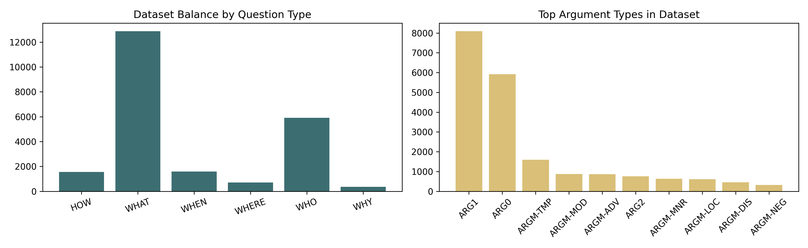

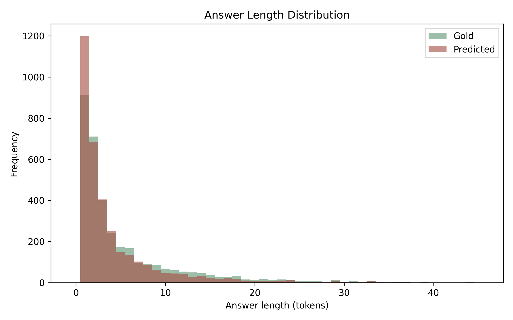

---

## Slide 48: PropQA-Net Input Design

### Context-Side Inputs

- Word embeddings with dimension `100`
- POS embeddings with dimension `32`
- Predicate indicator embeddings with dimension `8`

### Question-Side Inputs

- Shared word embeddings
- Question BiLSTM encoder
- Mean-pooled question representation

### Why These Inputs Are Sensible

- Word embeddings capture lexical content.
- POS tags provide lightweight syntax.
- Predicate flags tell the model which event anchor matters.
- Shared embeddings tie question vocabulary and context vocabulary together.

### Presentation Message

- The model is compact but semantically informed.
- It is not overloaded with unnecessary complexity.

### Speaker Notes

- Explain that the predicate flag is one of the most important design choices.
- Without it, the model would struggle in sentences containing multiple events.
- This is a compact way to inject event anchoring into the context representation.

### Evidence Anchors

- `srl_qa_project/config.py`
- `srl_qa_project/model.py`
- `srl_qa_project/docs/MODEL.md`

---

## Slide 49: PropQA-Net Architecture

### Architecture Summary

- BiLSTM context encoder.
- BiLSTM question encoder.
- Shared word embeddings.
- Token-level SRL classifier.
- Start and end span scorers.
- Question-context interaction features.
- Role-aware span selection at decode time.

### Architectural Advantages

- Simpler than transformer stacks.
- Easier to explain in a viva.
- Sufficiently expressive for sentence-level QA.
- Compatible with multi-task learning.
- Lightweight enough for offline CPU-friendly execution.

### Key Interaction Design

- Concatenate context state and question vector.
- Include element-wise product.
- Include absolute difference.
- Score both start and end positions.

### Speaker Notes

- Present this slide as the heart of the project.
- The model is intentionally balanced:
- semantically grounded,
- neural,
- but not over-complicated.
- It is a good academic architecture because every major component can be justified.

### Evidence Anchors

- `srl_qa_project/model.py`
- `srl_qa_project/docs/MODEL.md`
- `srl_qa_project/results/plots/propqa_architecture.png`

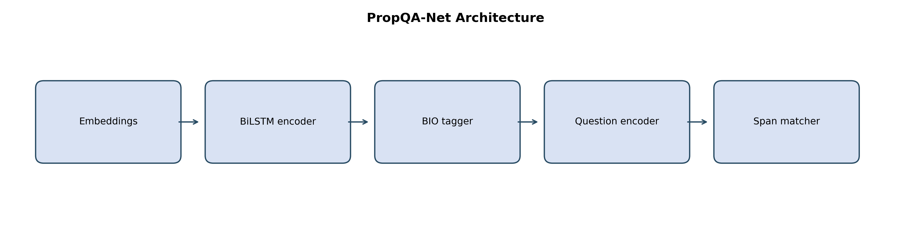

---

## Slide 50: Objective Function and Decoding

### Multi-Task Loss

- SRL loss:
- cross-entropy over BIO labels
- QA loss:
- average of start and end cross-entropy
- Final combination:
- `L = alpha * L_SRL + (1 - alpha) * L_QA`
- Default `alpha = 0.50`

### Decoding Strategy

- Decode candidate BIO spans from predicted labels.
- Compare candidate spans with the question vector using cosine similarity.
- Combine semantic match with boundary confidence.
- Choose the highest-scoring candidate.
- Fallback to best boundary span if clean BIO spans are unavailable.

### Why This Is Important

- The system does not rely only on boundary positions.
- It also uses role-structured candidate spans.
- This is one reason the baseline remains semantically meaningful.

### Speaker Notes

- Explain that decoding is where SRL and QA truly meet.
- Training already couples them through the loss.
- But decoding couples them again through candidate selection.
- This makes the architecture more coherent than two unrelated heads.

### Evidence Anchors

- `srl_qa_project/model.py`
- `srl_qa_project/docs/MODEL.md`

---

## Slide 51: Training Configuration

### Hyperparameters from `config.py`

- Batch size: `64`
- Learning rate: `1e-3`
- Weight decay: `1e-5`
- Max epochs: `6`
- Patience: `5`
- Gradient clip norm: `5.0`
- Dropout: `0.30`
- Hidden size: `128`
- Question hidden size: `128`
- Max sentence length: `128`
- Max question length: `32`
- Random seed: `42`

### Why These Settings Fit the Project

- They are conservative and stable.
- They support reproducibility.
- They keep training computationally reasonable.
- They match a medium-sized sentence-level task.

### Speaker Notes

- Mention that the project is tuned for practicality rather than maximum brute-force performance.
- The hyperparameters align with a small-to-medium research project that must finish reliably and produce analyzable outputs.

### Evidence Anchors

- `srl_qa_project/config.py`
- `srl_qa_project/trainer.py`

---

## Slide 52: Inference Baseline and Hybrid Extension

### Baseline Path

- The baseline uses the trained PropQA-Net model.
- It predicts:
- answer text,
- role,
- confidence,
- and decoded BIO labels.

### Hybrid Path

- Analyze the question intent.
- Map it to an expected semantic role.
- Generate candidates from:
- the baseline,
- heuristic extractors,
- and optional transformer QA.
- Rerank them using weighted semantic features.
- Return the final answer with a reasoning summary.

### Why This Matters

- The project retains a clean baseline.
- It then adds modern hybrid behavior without destroying interpretability.

### Speaker Notes

- This is the key implementation bridge between baseline system and innovation section.
- Show that the hybrid model is an add-on, not a replacement.
- That makes the benchmark comparisons meaningful.

### Evidence Anchors

- `srl_qa_project/qa_inference.py`
- `srl_qa_project/hybrid_qa.py`
- `srl_qa_project/results/plots/research_architecture.png`

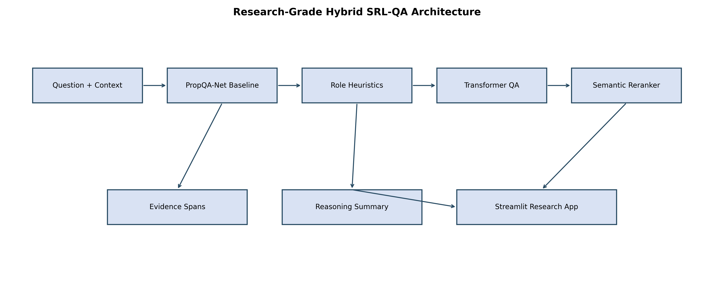

---

## Slide 53: Hybrid Reranking Design

### Feature Weights from Code

- Base source score: `0.30`
- Role match score: `0.32`
- Semantic alignment: `0.22`
- Lexical overlap: `0.06`
- Shape bonus: `0.10`
- Baseline agreement bonus: additional dynamic term

### Why This Design Is Good for a Presentation

- It is explicit.
- It is interpretable.
- It is tunable.
- It is easier to justify than a hidden reranker.

### Candidate Sources

- Baseline PropQA-Net prediction
- Heuristic agent extractor
- Heuristic theme extractor
- Heuristic recipient extractor
- Heuristic temporal extractor
- Heuristic location extractor
- Heuristic manner extractor
- Heuristic cause extractor
- Optional transformer QA proposals

### Speaker Notes

- When presenting this, stress that the reranker is not arbitrary.
- It encodes the project hypothesis:
- answer quality improves when role expectation and semantic compatibility are made explicit.

### Evidence Anchors

- `srl_qa_project/hybrid_qa.py`
- `srl_qa_project/docs/DETAILED_INNOVATION.md`

---

## Slide 54: Benchmark Framework and Research App

### Benchmark Tracks

- `classical_baseline`
- `heuristic_reranker`
- `transformer_qa_assist`
- `full_hybrid`

### What the Benchmark Adds

- Controlled comparison across design choices.
- Explicit trade-off analysis between accuracy and latency.
- Challenge-suite testing for representative role types.

### What the App Adds

- Interactive QA interface.
- Dataset explorer.
- Architecture view.
- Benchmark view.
- Download-ready artifacts.

### Speaker Notes

- This slide helps explain that the project is not only a trained model.
- It is also a communication system.
- The benchmark organizes evidence.
- The app makes that evidence presentable in a final demo.

### Evidence Anchors

- `srl_qa_project/benchmark.py`
- `srl_qa_project/app.py`
- `srl_qa_project/results/plots/benchmark.png`
- `srl_qa_project/results/plots/ablation_summary.png`

---

## Slide 55: PDF Deliverables and Submission Readiness

### Generated PDF Files

- `survey.pdf`
- `analysis.pdf`
- `innovation.pdf`
- `research_paper.pdf`

### Observed Page Counts in the Current Folder

- `survey.pdf`: `15` pages
- `analysis.pdf`: `16` pages
- `innovation.pdf`: `12` pages
- `research_paper.pdf`: `8` pages

### Why This Matters

- The project outputs are not limited to terminal logs.
- The system produces academic-style deliverables.
- This is a strong final-project characteristic.

### Speaker Notes

- Show that the codebase supports both experimentation and submission packaging.
- This helps the audience understand the repo as a complete academic workflow.

### Evidence Anchors

- `srl_qa_project/outputs/survey.pdf`
- `srl_qa_project/outputs/analysis.pdf`
- `srl_qa_project/outputs/innovation.pdf`
- `srl_qa_project/outputs/research_paper.pdf`
- `srl_qa_project/docs/PDF_DELIVERABLES.md`

---

## Slide 56: Figures to Keep in the Final Presentation

### Keep These Core Figures

| Figure | Why It Is Relevant |
|--------|--------------------|
| `research_architecture.png` | Best one-slide overview of the extended hybrid system |
| `propqa_architecture.png` | Best baseline model architecture explanation |
| `dataset_balance.png` | Shows class imbalance and supports results discussion |
| `answer_length_dist.png` | Explains extractive span difficulty characteristics |
| `loss_curve.png` | Demonstrates training dynamics |
| `qa_accuracy_by_qtype.png` | Best direct summary of QA behavior by question type |
| `f1_by_argtype.png` | Strong evidence for role-specific SRL behavior |
| `confusion_matrix.png` | Visual proof of role confusion patterns |
| `error_taxonomy.png` | Strong for analysis and discussion |
| `ablation_summary.png` | Essential for hybrid comparison |
| `latency_accuracy_tradeoff.png` | Essential for discussing practical trade-offs |
| `question_type_heatmap.png` | Useful for challenge-set discussion |
| `role_heatmap.png` | Useful for role-target comparison |
| `challenge_table.png` | Good for presentation-friendly benchmark summary |

### Optional Supporting Figures

- `hybridpropqa.png`
- `srl_pipeline.png`
- `propbank_example.png`
- `multi_predicate.png`
- `error_gallery.png`

### Speaker Notes

- This slide directly answers the user's instruction to keep only the relevant visual assets.
- The figures listed here are the ones that best support methodology, results, and innovation in a final presentation.

### Evidence Anchors

- `srl_qa_project/results/plots/`

---

## Slide 57: Baseline Evaluation Snapshot

### Core Test-Set Metrics

- QA Exact Match: `0.5184`
- QA Token F1: `0.7612`
- SRL Micro F1: `0.7133`
- SRL Macro F1: `0.1619`
- BIO Accuracy: `0.8163`

### What These Numbers Mean

- The baseline is reasonably strong for answer extraction.
- It is much stronger on frequent roles than on rare roles.
- The SRL micro score indicates usable overall sequence-label behavior.
- The SRL macro score reveals imbalance across many rare labels.

### Correct Interpretation

- The model is not equally good on every PropBank label.
- But it does learn a strong core of common semantic roles.
- That is enough to support a meaningful hybrid upgrade.

### Speaker Notes

- Use this slide to set expectations honestly.
- Do not oversell the baseline as state of the art.
- Present it as a semantically grounded baseline that performs well enough to justify deeper analysis and extension.

### Evidence Anchors

- `srl_qa_project/results/metrics.json`
- `srl_qa_project/docs/DETAILED_ANALYSIS.md`

---

## Slide 58: QA Performance by Question Type

### Measured QA Behavior

| Question Type | Exact Match | Token F1 | Count |
|---------------|------------:|---------:|------:|
| `WHO` | `0.6182` | `0.7788` | `867` |
| `WHAT` | `0.5049` | `0.8024` | `1,937` |
| `WHEN` | `0.5650` | `0.6871` | `246` |
| `WHERE` | `0.3818` | `0.6190` | `110` |
| `HOW` | `0.3590` | `0.5301` | `234` |
| `WHY` | `0.1754` | `0.6344` | `57` |

### Interpretation

- `WHO` and `WHAT` perform best overall because they are common and often syntactically stable.
- `WHEN` remains relatively manageable because many temporal expressions are compact and recognizable.
- `WHERE` and `HOW` are harder because prepositional and adverbial spans vary more.
- `WHY` is the hardest category by exact match because causal answers are semantically diverse and infrequent.

### Important Observation

- `WHY` has very low exact match but not the lowest token F1.
- That means the system often captures part of the causal phrase but misses exact boundaries.

### Speaker Notes

- This slide is useful because it links dataset distribution to performance.
- It also prepares the audience for the hybrid system, which especially targets role-sensitive failures like location, manner, and recipient extraction.

### Evidence Anchors

- `srl_qa_project/results/metrics.json`
- `srl_qa_project/results/plots/qa_accuracy_by_qtype.png`

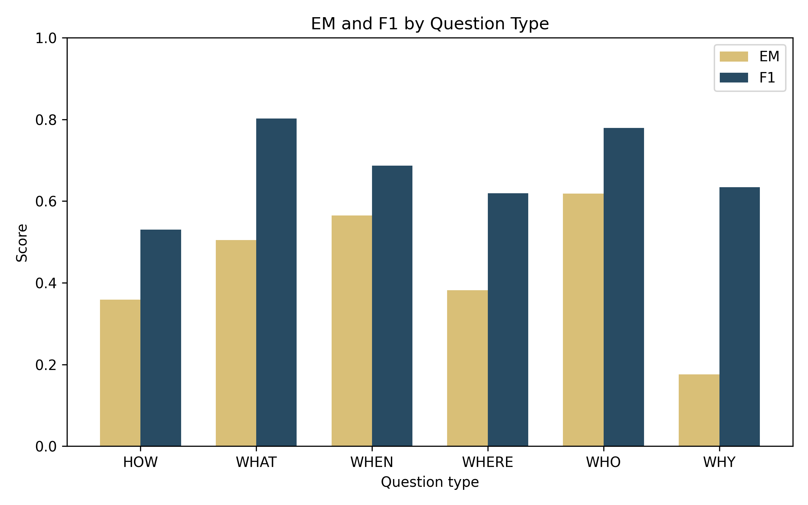

---

## Slide 59: SRL Performance by Role

### High-Performing Roles

- `ARG1` F1: `0.8521`
- `ARG0` F1: `0.7787`
- `ARGM-CAU` F1: `0.7061`
- `ARG4-to` F1: `0.6912`
- `ARGM-TMP` F1: `0.5875`
- `ARGM-LOC` F1: `0.5217`

### Very Strong Modifier Cases

- `ARGM-MOD` F1: `0.9478`
- `ARGM-NEG` F1: `0.9421`

### Difficult and Low-Support Cases

- Many rare `ARG2`, `ARG3`, `ARG4`, and specialized variants remain weak.
- Macro F1 is dragged down by rare labels with tiny support.
- This is exactly why the hybrid system focuses on answer behavior rather than promising uniform improvement on every rare SRL subtype.

### Speaker Notes

- Explain the difference between micro and macro carefully.
- Micro rewards performance on common labels.
- Macro exposes the long tail.
- That distinction helps justify the later hybrid design:
- practical answer quality can improve even if the rare-label tail remains difficult.

### Evidence Anchors

- `srl_qa_project/results/metrics.json`
- `srl_qa_project/results/plots/f1_by_argtype.png`

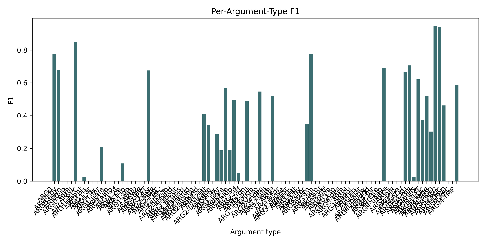

---

## Slide 60: Training Dynamics and Convergence

### What the Training Artifacts Suggest

- The project uses checkpointing and early stopping.
- Best checkpoint is stored in `checkpoints/best_model.pt`.
- Training is configured for up to `6` epochs.
- Validation metrics guide checkpoint selection.
- Loss trends are visualized in the results folder.

### Presentation Interpretation

- The project is not evaluated at an arbitrary stopping point.
- It follows a standard validation-aware training protocol.
- This makes the reported metrics more trustworthy.

### Speaker Notes

- Use the loss curve to tell a simple story:
- the system trained stably,
- a best checkpoint was selected,
- and the final results come from that checkpoint rather than a casual snapshot.

### Evidence Anchors

- `srl_qa_project/trainer.py`
- `srl_qa_project/results/plots/loss_curve.png`
- `srl_qa_project/checkpoints/best_model.pt`

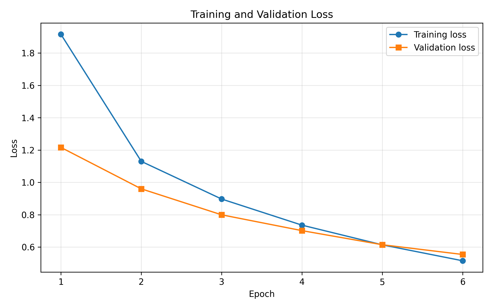

---

## Slide 61: Confusion and Failure Structure

### What the Confusion Matrix Tells Us

- Frequent roles dominate the prediction landscape.
- `ARG0` and `ARG1` are learned much better than rare or specialized variants.
- Some location-like or recipient-like spans can be confused with object-like spans.
- Modifier categories may also overlap when surface forms are ambiguous.

### Why This Matters

- These confusion patterns motivate the hybrid reranker.
- The reranker explicitly rewards role compatibility with the question.
- This is more targeted than relying only on span confidence.

### Speaker Notes

- Tell the audience that the confusion matrix is not just a diagnostic.
- It is also part of the design motivation for the hybrid system.
- In other words:
- the results helped shape the extension.

### Evidence Anchors

- `srl_qa_project/results/plots/confusion_matrix.png`
- `srl_qa_project/results/metrics.json`

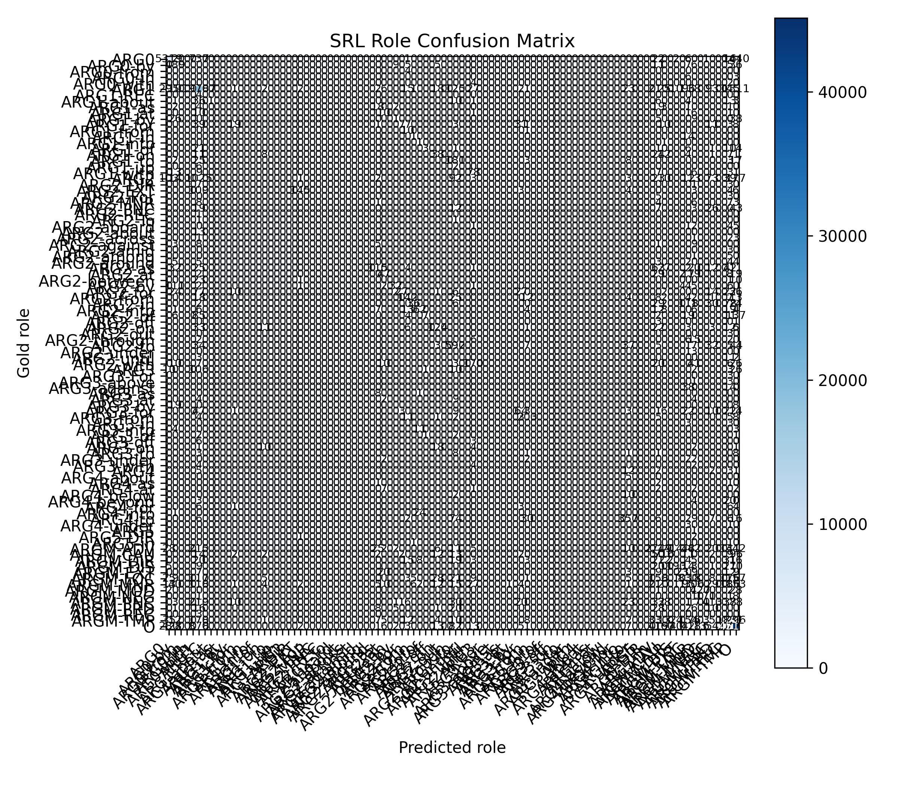

---

## Slide 62: Error Taxonomy

### Main Error Types

- Correct predictions
- Predicate misses
- Wrong-role predictions
- Span-boundary errors
- Other residual errors

### Why Span Boundaries Matter

- A prediction can be semantically close but still lose exact match.
- This is especially visible in `WHY`, `WHERE`, and some long `WHAT` answers.

### Why Wrong-Role Errors Matter

- Role mismatch is exactly where semantic grounding becomes valuable.
- A system may choose a plausible span from the sentence but assign or imply the wrong function.

### Speaker Notes

- Use this slide to highlight the difference between "textually plausible" and "semantically correct."
- That distinction is central to the project.

### Evidence Anchors

- `srl_qa_project/results/plots/error_taxonomy.png`
- `srl_qa_project/results/plots/error_gallery.png`
- `srl_qa_project/docs/DETAILED_ANALYSIS.md`

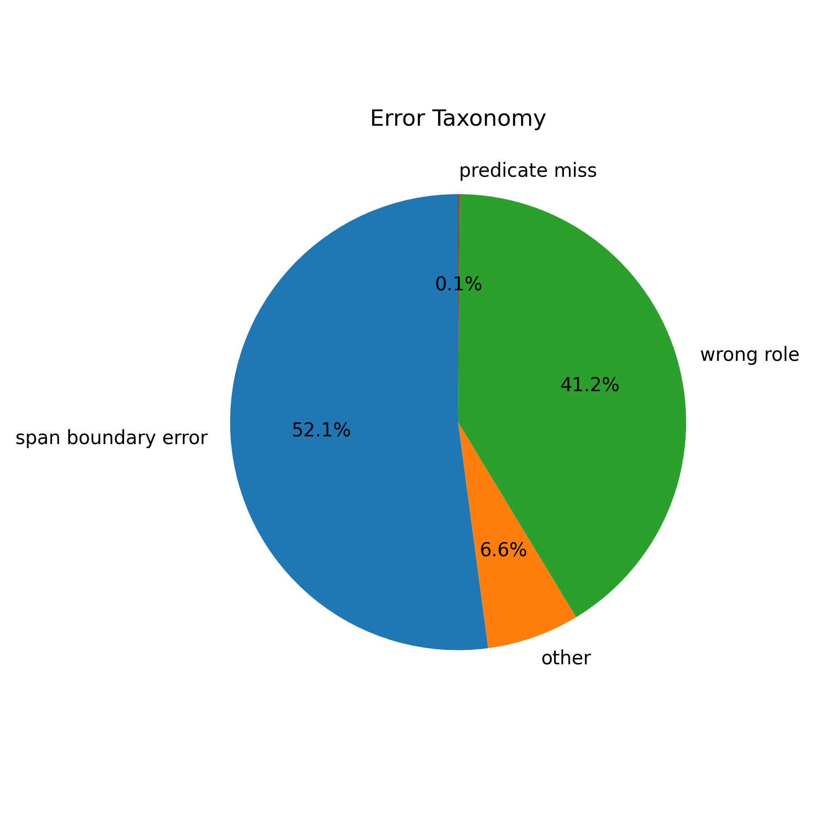

---

## Slide 63: Challenge Benchmark Summary

### Challenge-Set Results by Track

| Track | Exact Match | Token F1 | Role Accuracy | Mean Latency (ms) |
|-------|------------:|---------:|--------------:|------------------:|
| `classical_baseline` | `0.1000` | `0.4701` | `0.2000` | `2.89` |
| `heuristic_reranker` | `0.6000` | `0.7798` | `1.0000` | `3.26` |
| `transformer_qa_assist` | `0.6000` | `0.7798` | `1.0000` | `285.43` |
| `full_hybrid` | `0.6000` | `0.7798` | `1.0000` | `369.37` |

### Strong Conclusion

- The challenge-suite gain is dramatic.
- Baseline role accuracy is only `0.20`.
- The three upgraded tracks all reach perfect role accuracy on the challenge set.

### Practical Interpretation

- The biggest challenge-set gain comes from role-aware reranking and heuristics.
- Transformer support did not increase challenge-set scores beyond the heuristic reranker here.
- It did increase latency significantly.

### Speaker Notes

- This is one of the strongest slides in the deck.
- The message is not "full hybrid wins everything."
- The message is:
- semantic role-aware reranking changes answer behavior substantially on targeted examples.

### Evidence Anchors

- `srl_qa_project/results/benchmarks/benchmark_results.json`
- `srl_qa_project/results/plots/challenge_table.png`

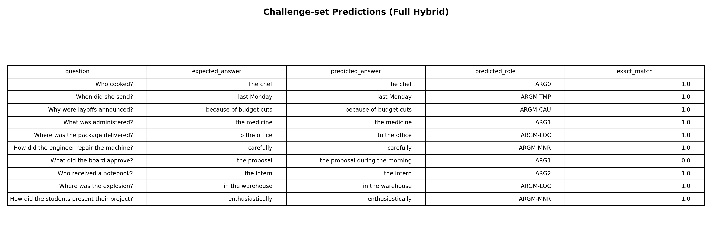

---

## Slide 64: Test-Subset Benchmark Summary

### Test-Subset Results by Track

| Track | Exact Match | Token F1 | Role Accuracy | Mean Latency (ms) |
|-------|------------:|---------:|--------------:|------------------:|
| `classical_baseline` | `0.0750` | `0.3086` | `0.3250` | `4.49` |
| `heuristic_reranker` | `0.2000` | `0.4176` | `0.6000` | `5.84` |
| `transformer_qa_assist` | `0.2000` | `0.4176` | `0.6000` | `290.72` |
| `full_hybrid` | `0.2000` | `0.4176` | `0.6000` | `380.99` |

### Honest Interpretation

- The upgraded tracks improve the sampled test subset over the baseline.
- But the gains are smaller than on the curated challenge suite.
- Transformer assistance again adds cost without adding sampled accuracy here.

### Important Project Lesson

- Better architecture is not only about adding heavier models.
- A well-designed heuristic-semantic reranker can deliver most of the observable gain on targeted tasks.

### Speaker Notes

- This is a good slide for discussing pragmatism.
- The repo shows that the cheapest upgraded track already captures much of the benefit.
- That is a meaningful engineering conclusion.

### Evidence Anchors

- `srl_qa_project/results/benchmarks/benchmark_results.json`
- `srl_qa_project/results/plots/benchmark.png`

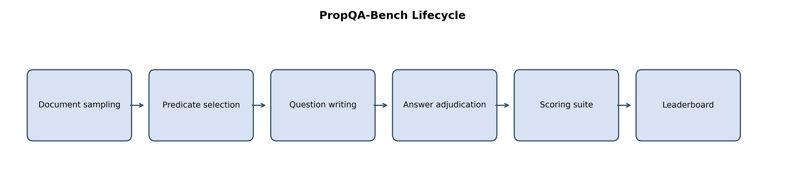

---

## Slide 65: Per-Question Improvements on the Test Subset

### Baseline vs Full Hybrid

| Question Type | Baseline F1 | Full Hybrid F1 | Interpretation |
|---------------|------------:|---------------:|----------------|
| `HOW` | `0.0641` | `0.5952` | Very strong gain for manner-like questions |
| `WHAT` | `0.1569` | `0.1711` | Minimal gain on sampled object/theme cases |
| `WHEN` | `0.5847` | `0.4967` | Hybrid did not help temporal questions in this subset |
| `WHERE` | `0.2135` | `0.4941` | Strong gain for location-sensitive questions |
| `WHO` | `0.5208` | `0.6053` | Moderate gain for agent questions |
| `WHY` | `0.4126` | `0.3075` | Hybrid underperformed on sampled causal cases |

### What This Tells Us

- The hybrid system is not uniformly better across all question types.
- It is most beneficial when role-specific extraction heuristics are reliable.
- It is weaker when causal or temporal phrasing is already well captured by the baseline or when the heuristics are less aligned.

### Speaker Notes

- This is an excellent honesty slide.
- It shows real analysis, not selective reporting.
- The audience will trust the presentation more if we show where the hybrid system helped and where it did not.

### Evidence Anchors

- `srl_qa_project/results/benchmarks/benchmark_results.json`
- `srl_qa_project/results/plots/question_type_heatmap.png`

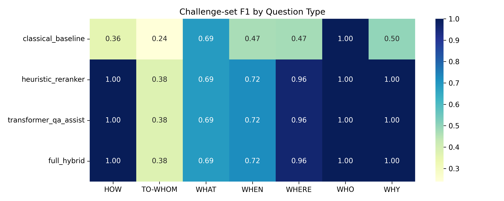

---

## Slide 66: Latency Versus Accuracy Trade-Off

### Key Observation

- `heuristic_reranker` is only slightly slower than baseline.
- `transformer_qa_assist` and `full_hybrid` are far slower.
- On the observed benchmark subsets, all three upgraded tracks have the same accuracy summary.

### Practical Recommendation

- If the use case values fast interactive response on CPU:
- prefer `heuristic_reranker`.
- If the use case values experimentation with broader candidate sources:
- use `full_hybrid`.

### Presentation Message

- This project does not just report accuracy.
- It also studies engineering trade-offs.

### Speaker Notes

- This slide is especially useful for faculty questions about deployment.
- It shows that the project thinks in system terms:
- not only "which answer is correct,"
- but also "what does it cost to get that answer?"

### Evidence Anchors

- `srl_qa_project/results/plots/latency_accuracy_tradeoff.png`
- `srl_qa_project/results/benchmarks/benchmark_results.json`

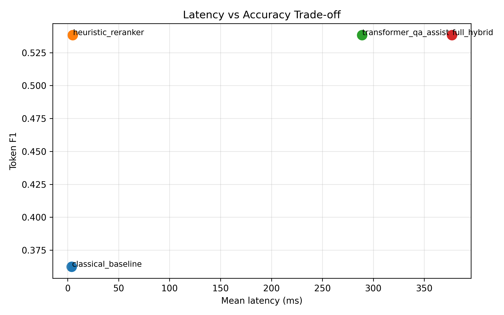

---

## Slide 67: Comparison with Earlier Systems

### Earlier System Patterns

- Classical SRL systems were interpretable but not question-facing.
- Extractive QA systems were question-facing but not role-explicit.
- QA-SRL made roles question-oriented but did not necessarily provide this exact repository-integrated multi-task setup.
- Transformer readers improved extraction but were not inherently role-aware.
- Hybrid systems improved robustness but often lacked transparent semantic feature design.

### Our System Compared to That History

- Keeps semantic structure visible.
- Keeps extractive QA functionality.
- Adds role-conditioned reranking.
- Adds deterministic reasoning summaries.
- Adds benchmark and app layers.
- Remains locally reproducible.

### Speaker Notes

- This slide is where the survey and implementation sections converge.
- It proves that the project is not just combining buzzwords.
- It combines specific strengths from prior directions in a coherent way.

### Evidence Anchors

- `srl_qa_project/docs/DETAILED_SURVEY.md`
- `srl_qa_project/docs/DETAILED_INNOVATION.md`
- `srl_qa_project/README.md`

---

## Slide 68: Innovation Summary

### Innovation 1

- SRL-anchored QA as a multi-task learning problem.

### Innovation 2

- Role-aware question parsing that predicts expected semantic roles.

### Innovation 3

- Multi-channel candidate generation from baseline, heuristics, and optional transformer QA.

### Innovation 4

- Weighted semantic reranking with interpretable feature contributions.

### Innovation 5

- Deterministic reasoning traces rather than opaque post-hoc summaries.

### Innovation 6

- Reproducible offline pipeline using bundled corpus assets, saved metrics, plots, and PDF outputs.

### Speaker Notes

- This slide should sound like a synthesis slide, not a claim of absolute novelty at every subcomponent.
- The project innovation lies strongly in integration, transparency, and research packaging.

### Evidence Anchors

- `srl_qa_project/docs/DETAILED_INNOVATION.md`
- `srl_qa_project/hybrid_qa.py`
- `srl_qa_project/benchmark.py`
- `srl_qa_project/app.py`

---

## Slide 69: Limitations and Honest Boundaries

### Current Limitations

- Rare PropBank labels remain difficult.
- Macro SRL performance reveals a long-tail weakness.
- Question generation is template-based rather than paraphrase-rich.
- The benchmark improvement is strongest on the curated challenge set.
- Transformer assistance increases latency heavily on CPU.
- Some categories such as `WHY` and some `WHEN` cases remain difficult even after hybridization.

### Why It Is Still a Strong Project

- The limitations are identified and measured.
- The project documents them transparently.
- The results still demonstrate clear semantic and engineering value.

### Speaker Notes

- Do not hide limitations.
- In a strong final presentation, limitations increase credibility.
- They also create a natural path into future work.

### Evidence Anchors

- `srl_qa_project/docs/DETAILED_ANALYSIS.md`
- `srl_qa_project/results/metrics.json`
- `srl_qa_project/results/benchmarks/benchmark_results.json`

---

## Slide 70: Future Work

### Logical Next Steps

- Expand beyond the local Treebank-backed PropBank subset.
- Add richer question paraphrasing while preserving semantic control.
- Improve rare-role handling through role grouping or data augmentation.
- Add calibration methods for confidence quality.
- Explore better causal and temporal candidate modeling.
- Use transformer support more selectively to reduce latency overhead.
- Add human evaluation of reasoning summaries and app usability.

### Why These Are Natural Extensions

- They directly follow from the observed weaknesses.
- They build on existing repository modules rather than requiring a total redesign.
- They preserve the project's structured-semantic identity.

### Speaker Notes

- Future work should sound like a continuation of the same research program.
- The project already has the modular structure needed to support these extensions.

### Evidence Anchors

- `srl_qa_project/docs/DETAILED_INNOVATION.md`
- `srl_qa_project/docs/DETAILED_ANALYSIS.md`

---

## Slide 71: Final Technical Takeaway

### Strongest One-Line Conclusion

The project shows that question answering becomes more informative when answer extraction is grounded in semantic role structure and then refined with role-aware hybrid inference.

### Supporting Points

- Baseline PropQA-Net provides a semantically meaningful QA backbone.
- The hybrid layer improves targeted role-sensitive behavior.
- The heuristic-semantic reranker gives most of the observed benchmark gain at a low extra cost.
- The repo is presentation-ready because it includes docs, plots, benchmarks, PDFs, and an app.

### Speaker Notes

- This is the slide you should use if time is short.
- It condenses the whole project into an academically defensible claim.

### Evidence Anchors

- `srl_qa_project/results/metrics.json`
- `srl_qa_project/results/benchmarks/benchmark_results.json`
- `srl_qa_project/outputs/`

---

## Slide 72: Appendix Preparation Slide

### Why This Appendix Exists

- The presentation is intentionally large and defense-ready.
- The appendix helps convert the deck into a speaking document.
- It also preserves repository evidence in a form that is easy to cite during viva questions.

### What Follows

- A module-to-claim evidence matrix.
- A plot catalog with relevance decisions.
- A suggested live demo order.
- Viva-style questions with prepared answers.
- A closing repository reference map.

### Speaker Notes

- If time is short during the actual presentation, these appendix slides do not need to be shown in full.
- They are included so the document remains useful even outside the final talk.

---

## Slide 73: Module-to-Claim Evidence Matrix

### Use This Slide When You Need to Justify a Specific Claim

| Presentation Claim | Primary File Evidence | Secondary Evidence | Why It Is Reliable |
|--------------------|----------------------|-------------------|-------------------|
| The project is modular | `srl_qa_project/README.md` | `srl_qa_project/docs/OVERVIEW.md` | Repo structure and docs agree |
| The project is configurable | `srl_qa_project/config.py` | `srl_qa_project/main.py` | Hyperparameters and paths are centralized |
| Data comes from PropBank and Treebank | `srl_qa_project/data_loader.py` | `srl_qa_project/nltk_data/` | Loader and local assets align |
| Question generation is deterministic | `srl_qa_project/data_loader.py` | `srl_qa_project/results/data_statistics.json` | Templates are coded and outputs are cached |
| The model is multi-task | `srl_qa_project/model.py` | `srl_qa_project/docs/MODEL.md` | Architecture and documentation match |
| Training uses early stopping and checkpointing | `srl_qa_project/trainer.py` | `srl_qa_project/checkpoints/best_model.pt` | Procedure and artifact both exist |
| Evaluation includes more than one metric | `srl_qa_project/evaluator.py` | `srl_qa_project/results/metrics.json` | Code and saved outputs agree |
| The project supports baseline QA inference | `srl_qa_project/qa_inference.py` | `srl_qa_project/main.py` | Inference path is wired in CLI |
| The project supports hybrid QA | `srl_qa_project/hybrid_qa.py` | `srl_qa_project/benchmark.py` | Hybrid logic and benchmark logic are both present |
| Hybrid reranking is interpretable | `srl_qa_project/hybrid_qa.py` | benchmark evidence spans in JSON | Feature weights are explicitly visible |
| Benchmarks compare multiple tracks | `srl_qa_project/benchmark.py` | `results/benchmarks/benchmark_results.json` | Track names and results are saved |
| The project includes a web demo | `srl_qa_project/app.py` | `srl_qa_project/main.py` | App code and launch command align |
| The project generates report artifacts | `srl_qa_project/docs/PDF_DELIVERABLES.md` | `srl_qa_project/outputs/` | Deliverable docs and final files both exist |
| The project is reproducible offline | `srl_qa_project/nltk_data/` | `srl_qa_project/README.md` | Bundled assets reduce external dependence |
| The project includes long-form research framing | `srl_qa_project/docs/DETAILED_SURVEY.md` | `DETAILED_ANALYSIS.md`, `DETAILED_INNOVATION.md` | Multi-document support for claims |

### Speaker Notes

- This slide is a defense tool.
- It helps answer:
- "Where exactly is that claim coming from?"
- Use it selectively if challenged on methodology or completeness.

---

## Slide 74: Plot Catalog with Keep or Support Decision

### Figure Inventory

| Plot File | Status | Use in Final Presentation | Reason |
|-----------|--------|---------------------------|--------|
| `ablation_summary.png` | Keep | Yes | Best compact comparison of track-level performance |
| `answer_length_dist.png` | Keep | Yes | Supports extractive span difficulty analysis |
| `benchmark.png` | Keep | Yes | Good compact benchmark summary |
| `challenge_table.png` | Keep | Yes | Presentation-friendly challenge snapshot |
| `confidence_histogram.png` | Support | Optional | Useful for calibration discussion only |
| `confusion_matrix.png` | Keep | Yes | Strong evidence for role confusion behavior |
| `dataset_balance.png` | Keep | Yes | Explains label imbalance clearly |
| `error_gallery.png` | Support | Optional | Useful if showing examples of wrong predictions |
| `error_taxonomy.png` | Keep | Yes | Best high-level failure structure plot |
| `f1_by_argtype.png` | Keep | Yes | Essential for per-role SRL interpretation |
| `frame_graph.png` | Support | Optional | Useful if discussing semantic resource structure |
| `frame_memory.png` | Support | Optional | More niche systems discussion |
| `hybridpropqa.png` | Support | Optional | Good secondary architecture image |
| `latency_accuracy_tradeoff.png` | Keep | Yes | Essential for engineering trade-offs |
| `loss_curve.png` | Keep | Yes | Shows stable training process |
| `multi_predicate.png` | Support | Optional | Useful if asked about complex event contexts |
| `propagent.png` | Support | Optional | Supporting semantic role illustration |
| `propbank_example.png` | Support | Optional | Good for explaining annotation grounding |
| `propqa_architecture.png` | Keep | Yes | Best baseline architecture figure |
| `qa_accuracy_by_qtype.png` | Keep | Yes | Excellent summary of QA behavior |
| `question_type_heatmap.png` | Keep | Yes | Useful for track-wise challenge interpretation |
| `research_architecture.png` | Keep | Yes | Best overview of the full extended system |
| `role_heatmap.png` | Keep | Yes | Useful for target-role analysis |
| `srl_pipeline.png` | Support | Optional | Good if a dedicated data pipeline slide is needed |

### Speaker Notes

- This slide directly satisfies the instruction to keep the relevant visuals and filter the rest intelligently.
- It also reduces clutter during the actual oral presentation.

---

## Slide 75: Suggested Live Demo Flow

### Demo Order

1. Start with the simplest baseline-style semantic question.
2. Show the same task in the hybrid system.
3. Switch to a role-sensitive case like location or recipient.
4. Show the reasoning summary.
5. Show the evidence span table in the app.
6. Close with benchmark or architecture screenshots if live latency becomes an issue.

### Suggested Demo Questions

- Who cooked?
- When did she send?
- Where was the package delivered?
- How did the engineer repair the machine?
- Why were layoffs announced?
- Who received a notebook?

### Demo Safety Advice

- If internet or model download conditions are uncertain, prefer the heuristic or cached hybrid demonstration.
- Use short contexts first.
- Keep a benchmark screenshot ready.
- Keep the architecture image ready.

### Speaker Notes

- In a final project presentation, live demos are powerful but risky.
- The safest strategy is to demonstrate one baseline case and one hybrid improvement case.
- Then fall back to saved plots if anything slows down.

---

## Slide 76: Viva Question Bank I

### Likely Questions and Strong Answers

#### Q1. Why did you choose PropBank instead of creating your own dataset?

- PropBank already provides semantically grounded predicate-argument annotations.
- Creating our own annotations would have reduced reliability and increased subjectivity.
- Using PropBank lets the project stand on a recognized semantic resource.
- The local bundled corpus also helps reproducibility.

#### Q2. Why did you use only the Treebank-backed subset?

- Because answer spans must be reconstructed deterministically from the same tokenization used for labels.
- If an instance cannot be aligned to the local Treebank parse, the span supervision becomes uncertain.
- The subset choice is therefore a quality filter, not arbitrary data loss.

#### Q3. Why not build a transformer-only system?

- The project prioritizes semantic transparency, modularity, and offline reproducibility.
- A transformer-only system would make role-aware reasoning less explicit.
- Instead, we use transformers as optional support inside a hybrid design.

#### Q4. What is actually novel here?

- The novelty lies in the integration:
- PropBank-backed question generation,
- joint SRL and QA learning,
- role-aware hybrid reranking,
- deterministic reasoning traces,
- and a complete research package with benchmarks and app.

---

## Slide 77: Viva Question Bank II

#### Q5. Why is macro F1 much lower than micro F1?

- Because the label space contains many rare PropBank variants.
- Micro F1 is dominated by frequent roles such as `ARG0` and `ARG1`.
- Macro F1 exposes the long tail, where rare categories remain difficult.

#### Q6. Why do `WHY` questions have poor exact match?

- Causal expressions are rare and structurally diverse.
- The model often captures part of the answer span but not the exact boundaries.
- That is why token F1 can remain meaningfully higher than exact match.

#### Q7. Why does the hybrid model not improve every question type?

- The hybrid system helps most when role expectations and heuristic patterns align strongly.
- For some temporal or causal cases, the added heuristics may not outperform the baseline.
- The benchmark results reflect this honestly.

#### Q8. Why is the heuristic reranker almost as good as the full hybrid on your benchmark subsets?

- Because explicit role-aware heuristics already capture many of the targeted gains.
- On the observed subsets, transformer proposals do not add new winning candidates often enough to improve accuracy further.
- They do, however, increase latency.

---

## Slide 78: Viva Question Bank III

#### Q9. What would you improve first if you had more time?

- I would improve rare-role handling and add better paraphrastic question generation.
- I would also target causal and temporal reasoning more carefully because those categories remain weaker.

#### Q10. Is this system useful outside the classroom?

- Yes, especially as a semantic QA prototype for educational, explainability, or event-structure analysis settings.
- It is also useful as a reproducible research scaffold for further SRL-QA experimentation.

#### Q11. Why is a reasoning summary valuable if it is deterministic and short?

- Because it explains the decision path without inventing unsupported justifications.
- It is cheaper and more reproducible than free-form generative explanations.

#### Q12. How do you defend the use of template-based questions?

- Templates preserve control over semantic intent.
- They reduce annotation noise.
- They are appropriate because the source labels already encode role meaning.

---

## Slide 79: Viva Question Bank IV

#### Q13. What is the biggest strength of the project?

- Its strongest feature is the combination of semantic grounding and practical usability.
- The model, metrics, plots, benchmark framework, and app all support the same research story.

#### Q14. What is the biggest weakness of the project?

- The long-tail PropBank label space remains difficult.
- The hybrid extension also does not deliver uniform gains across all sampled question types.

#### Q15. How would you describe the project in one sentence to a non-specialist?

- It is a question-answering system that tries to understand what role the answer plays in the event described by the sentence.

#### Q16. Why is this better than ordinary extractive QA for some tasks?

- Because it does not only locate text.
- It uses semantic expectations to decide which span best fits the question.

---

## Slide 80: Repository Artifact Reference Map

### Core Reading Order for a Reviewer

1. Read `srl_qa_project/README.md`.
2. Read `docs/OVERVIEW.md`.
3. Read `docs/DETAILED_SURVEY.md`.
4. Read `docs/DETAILED_ARCHITECTURE.md`.
5. Inspect `data_loader.py` and `model.py`.
6. Inspect `results/data_statistics.json`.
7. Inspect `results/metrics.json`.
8. Inspect `results/benchmarks/benchmark_results.json`.
9. View selected plots from `results/plots/`.
10. Open the generated PDFs in `outputs/`.

### Why This Order Works

- It moves from concept to implementation to evidence.
- It mirrors the structure used in this presentation file.

---

## Appendix A: Extended Viva Questions and Prepared Answers

### QA Set A

#### Question 1

What is the central research problem of this project?

#### Suggested Answer

The project addresses the gap between extractive question answering and semantic role understanding.
Standard QA can return a text span, but it does not naturally explain the role that the span plays in the event.
This project therefore combines semantic role labeling and question answering so that answer selection is grounded in predicate-argument structure.

#### Question 2

Why is the answer role important?

#### Suggested Answer

Because many sentences contain several plausible spans.
Knowing the expected role lets the system prefer the span that matches the intent of the question.
That makes the answer more interpretable and often more semantically correct.

#### Question 3

What exactly is meant by semantic role labeling in this project?

#### Suggested Answer

It means assigning PropBank-style argument labels such as `ARG0`, `ARG1`, `ARGM-TMP`, and `ARGM-LOC` to spans around a predicate.
These labels describe who did the action, what was affected, when it happened, where it happened, and related event roles.

#### Question 4

How do you convert semantic roles into QA supervision?

#### Suggested Answer

The data loader generates natural-language questions from role templates.
For example, an `ARG0` span becomes a `Who` question, a temporal modifier becomes a `When` question, and a location modifier becomes a `Where` question.
The gold answer span comes directly from the PropBank-backed argument span.

#### Question 5

Why did you not annotate a custom dataset?

#### Suggested Answer

Using PropBank gives the project a stronger semantic foundation.
It also reduces subjective annotation error.
Finally, it makes the system easier to compare conceptually with the existing SRL literature.

### QA Set B

#### Question 6

What was the motivation for using a BiLSTM instead of a transformer as the main model?

#### Suggested Answer

The project aimed for a balanced architecture that is easier to analyze and lighter to run locally.
A BiLSTM is strong enough for sentence-level contextual modeling while remaining more transparent and lightweight than a large pretrained transformer stack.

#### Question 7

What do the predicate indicator embeddings contribute?

#### Suggested Answer

They tell the model which token is the event anchor of interest.
This is especially useful in sentences with multiple possible predicates.
Without this signal, the model could confuse arguments belonging to different events.

#### Question 8

Why share the word embeddings between context and question encoders?

#### Suggested Answer

Shared embeddings reduce parameter duplication and help align vocabulary usage between the question and the context.
This is useful because many important lexical cues appear in both places.

#### Question 9

Why is the question vector mean-pooled?

#### Suggested Answer

Mean pooling is simple, stable, and sufficient for short template-generated questions.
It avoids adding unnecessary complexity to a model whose main novelty lies elsewhere.

#### Question 10

How do SRL and QA interact during decoding?

#### Suggested Answer

The model first decodes BIO spans from predicted SRL labels.
It then compares candidate spans with the question vector and combines semantic similarity with span boundary confidence.
This is the point where semantic-role structure directly influences answer selection.

### QA Set C

#### Question 11

Why is the dataset skewed toward `WHAT` and `WHO` questions?

#### Suggested Answer

Because PropBank naturally contains many core agent and patient/theme arguments.
Those roles appear far more often than rarer causal or specialized argument types.

#### Question 12

How does dataset imbalance affect the results?

#### Suggested Answer

It makes the model stronger on frequent labels and weaker on rare ones.
This is visible in the difference between micro and macro SRL performance.

#### Question 13

Why are `WHY` questions difficult?

#### Suggested Answer

Causal phrases are relatively rare and structurally diverse.
They are also more sensitive to longer spans and boundary variation.

#### Question 14

Why are `WHERE` and `HOW` good targets for hybrid improvement?

#### Suggested Answer

Because role-aware heuristics can often identify characteristic surface patterns.
Location phrases often involve prepositions, and manner phrases often involve adverbs or instrumental constructions.

#### Question 15

What does low macro SRL F1 tell us?

#### Suggested Answer

It tells us the model still struggles with the long tail of specialized labels.
This is a realistic outcome on PropBank-style data and a valid area for future work.

### QA Set D

#### Question 16

What is the purpose of the hybrid system?

#### Suggested Answer

The hybrid system adds multiple answer channels and role-aware reranking on top of the baseline model.
Its goal is to improve answer quality for semantically sensitive questions without losing interpretability.

#### Question 17

What are the candidate sources in the hybrid system?

#### Suggested Answer

The baseline PropQA-Net answer,
role-specific heuristics,
and optional transformer-based extractive QA proposals.

#### Question 18

Why is role-aware reranking useful?

#### Suggested Answer

Because it aligns answer selection with the expected semantic role implied by the question.
This helps the system reject plausible-but-wrong spans that do not match the intended role.

#### Question 19

What does the shape bonus do?

#### Suggested Answer

It rewards spans whose surface form fits the expected role pattern.
For example, location phrases often begin with prepositions, temporal expressions contain time markers, and manner expressions may look adverbial.

#### Question 20

Why keep a baseline bonus in the reranker?

#### Suggested Answer

Because the baseline model still contains useful learned semantic information.
The reranker should not discard that information completely.
Instead, it should combine baseline evidence with structured heuristics.

### QA Set E

#### Question 21

What do the challenge benchmark results show?

#### Suggested Answer

They show that role-aware upgraded tracks strongly outperform the pure baseline on curated role-sensitive examples.
The baseline challenge role accuracy is only `0.20`, while the upgraded tracks reach `1.00` on that set.

#### Question 22

What do the test-subset benchmark results show?

#### Suggested Answer

They show improvement over baseline, but less dramatically than on the challenge set.
This suggests the hybrid extension is especially strong on targeted role-sensitive cases rather than universally dominant.

#### Question 23

Why did the heuristic reranker perform as well as the full hybrid on the observed subsets?

#### Suggested Answer

Because many of the gains came from role-aware heuristics and explicit reranking rather than from transformer proposals.
That is a meaningful engineering insight from the project.

#### Question 24

Does transformer assistance still have value?

#### Suggested Answer

Yes, as an optional broader candidate source.
But in the current benchmark subsets it increases latency more than it increases measured summary performance.

#### Question 25

What is the most practical deployment choice from the benchmark?

#### Suggested Answer

The heuristic reranker is the most practical upgrade when fast CPU inference matters.
It delivers much of the improvement with only a small latency cost.

### QA Set F

#### Question 26

What is the role of the Streamlit app?

#### Suggested Answer

The app turns the project into an interactive research demonstration.
It exposes the model, benchmark outputs, dataset statistics, architecture visuals, and reasoning traces in a presentation-friendly interface.

#### Question 27

Why generate PDFs programmatically?

#### Suggested Answer

Programmatic generation makes the reporting pipeline consistent and reproducible.
It also demonstrates that the project supports complete academic deliverables.

#### Question 28

Why is the project stronger because it includes plots and JSON outputs?

#### Suggested Answer

Because those artifacts let others inspect the evidence directly.
They make the project easier to defend, reproduce, and extend.

#### Question 29

Why is deterministic reasoning better than fully generative reasoning in this setting?

#### Suggested Answer

Because it avoids unsupported hallucinated explanations.
It ensures that the reasoning summary reflects the actual decision logic of the system.

#### Question 30

If you continued this project, what would you add first?

#### Suggested Answer

I would improve rare-role modeling, paraphrastic question generation, and better targeted handling of causal and temporal questions.
I would also test more selective transformer integration to control latency.

---

## Appendix B: Presenter Script by Segment

### Segment A Opening Script

- Start by saying the project sits between semantic role labeling and question answering.
- Explain that the survey is needed because these two areas evolved mostly in parallel.
- State the key claim:
- answer extraction becomes more informative when grounded in semantic roles.

### Segment A Midpoint Script

- Move from linguistic foundations to computational systems.
- Explain that classical SRL gave us structure.
- Explain that neural SRL gave us learned contextual representations.
- Explain that extractive QA gave us efficient span prediction.
- Explain that QA-SRL suggested a conceptual bridge.

### Segment A Closing Script

- Conclude the survey by identifying the gap:
- existing systems often offered either role structure or answer extraction,
- but not an integrated, reproducible, role-aware QA package like this one.

### Segment B Opening Script

- Tell the audience that the rest of the presentation is grounded directly in repository files.
- Briefly name the modules that matter most:
- `data_loader.py`,
- `model.py`,
- `hybrid_qa.py`,
- and `benchmark.py`.

### Segment B Data Script

- Explain that the pipeline begins with local PropBank and Treebank resources.
- Emphasize that only Treebank-backed instances are retained.
- Point out the exact counts:
- `112,917` total visible instances,
- `9,073` usable instances,
- and `23,007` QA pairs.

### Segment B Model Script

- Explain the three key inputs on the context side:
- words,
- POS tags,
- and predicate indicators.
- Explain that the model jointly predicts SRL BIO tags and answer boundaries.
- Explain that decoding uses both BIO spans and question alignment.

### Segment B Hybrid Script

- Describe the hybrid extension as a controlled overlay.
- It adds question intent analysis.
- It adds candidate generation from multiple channels.
- It adds explicit reranking features.
- It adds a reasoning summary.

### Segment C Opening Script

- Introduce the results with honesty.
- Say that the baseline is useful, semantically grounded, and not state-of-the-art.
- Emphasize that the strength of the project is analytical clarity plus targeted improvement.

### Segment C Metrics Script

- Walk through QA EM and F1 first.
- Then explain SRL micro and macro F1.
- Then connect the difference between frequent and rare roles to the long-tail PropBank label space.

### Segment C Benchmark Script

- Explain that the benchmark compares four tracks, not just one model.
- Point out that the heuristic reranker captures most gains at low cost.
- Point out that transformer support increases latency substantially.

### Segment C Closing Script

- End the results section by stating that semantic-role-aware reranking helps most for role-sensitive questions such as location, manner, and recipient extraction.
- Also state clearly that not every category improves, which is why the analysis remains credible.

### Segment D Script

- Present innovation as integration, transparency, and system design rather than as isolated novelty claims.
- Emphasize reproducibility, hybrid reasoning, and explainable answer selection.

### Final Closing Script

- Close with the statement that the project makes answers more useful by tying them to event roles.
- Remind the audience that the repo includes code, data assets, metrics, plots, app, and PDFs.

---

## Appendix C: Compact Reference List for Oral Presentation

### Internal Project References

- `srl_qa_project/README.md`
- `srl_qa_project/docs/OVERVIEW.md`
- `srl_qa_project/docs/DATA.md`
- `srl_qa_project/docs/MODEL.md`
- `srl_qa_project/docs/EVALUATION.md`
- `srl_qa_project/docs/PDF_DELIVERABLES.md`
- `srl_qa_project/docs/DETAILED_SURVEY.md`
- `srl_qa_project/docs/DETAILED_ANALYSIS.md`
- `srl_qa_project/docs/DETAILED_INNOVATION.md`
- `srl_qa_project/docs/DETAILED_ARCHITECTURE.md`
- `srl_qa_project/results/data_statistics.json`
- `srl_qa_project/results/metrics.json`
- `srl_qa_project/results/benchmarks/benchmark_results.json`

### Literature Directions Referenced by the Project Docs and App

- Frame Semantics
- Case Grammar
- PropBank
- Classical parse-feature SRL
- BiLSTM-based SRL
- Attention-based SRL
- BERT-style SRL
- Early information-retrieval QA
- Extractive QA and SQuAD-style span prediction
- QA-SRL
- Transformer QA
- LLM-based structured semantic reasoning

### Closing Note

- This presentation file is intentionally expanded so it can function both as:
- the final Markdown presentation,
- and a defense-oriented speaking document.
