# Project Flows And Architecture Diagrams

## Purpose

This document explains the full project using many flow diagrams and architecture diagrams.

It is designed for:

- understanding the project quickly,
- preparing a presentation,
- explaining the demo,
- connecting implementation folders with research ideas,
- showing how SRL, RAG, QA, PropBank, and explainability fit together.

The main project idea is:

```text
Use Semantic Role Labeling to make Question Answering more structured, retrievable, and explainable.
```

## 1. Complete Project Map

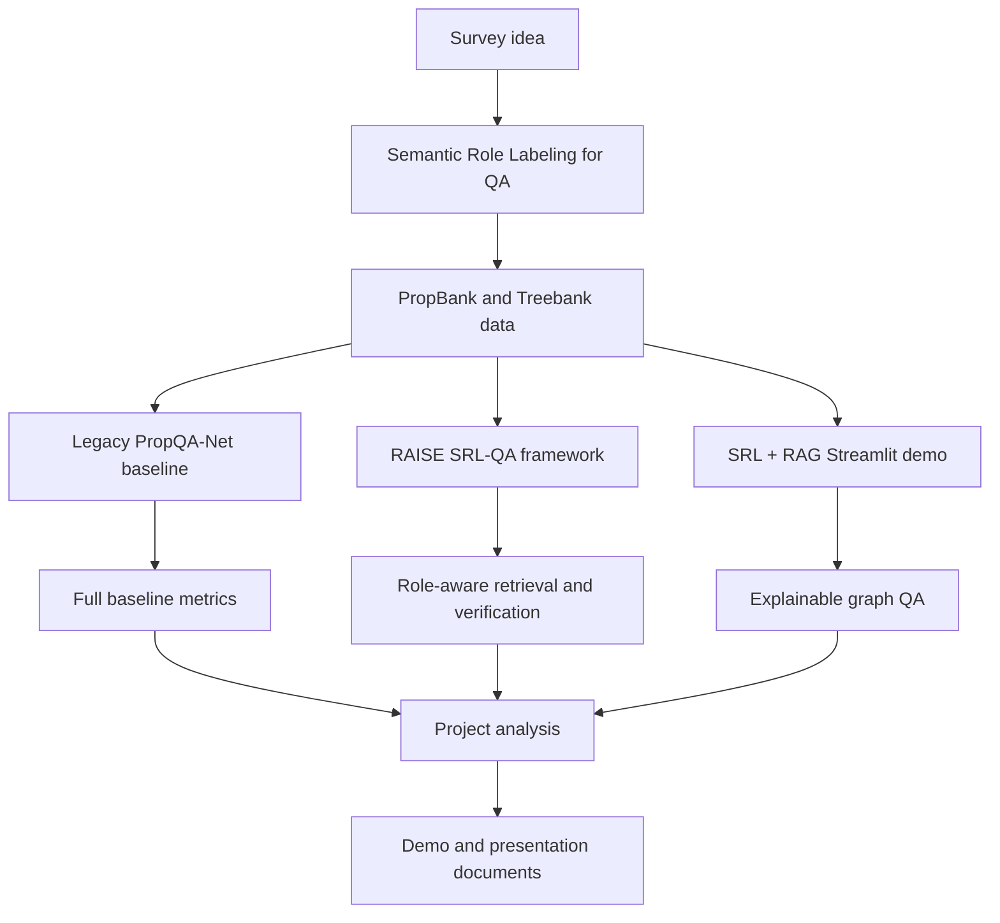

Explanation:

The project begins with the survey idea that QA should use semantic structure. PropBank and Treebank provide the structured data. The workspace then has three main implementation paths: the legacy baseline, the newer RAISE framework, and the final SRL + RAG Streamlit demo. All of them connect to the final project analysis and presentation materials.

## 2. Workspace Folder Architecture

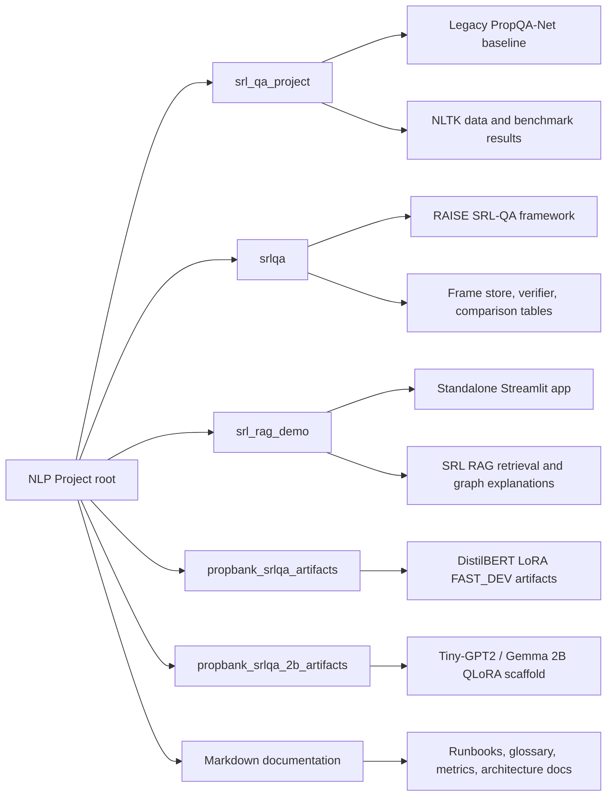

Explanation:

The workspace is organized by implementation branch. `srl_qa_project` is the original baseline. `srlqa` is the newer role-aware framework. `srl_rag_demo` is the final live demo app. The artifact folders preserve model experiment outputs. The markdown files explain, compare, and present the work.

## 3. Research Story Flow

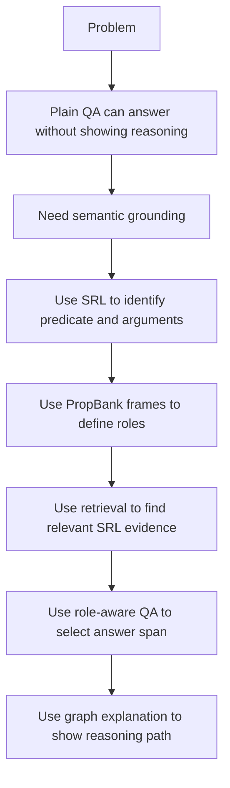

Explanation:

The research story is simple: normal QA can be difficult to explain. SRL gives structure by identifying roles such as `ARG0`, `ARG1`, `ARGM-LOC`, and `ARGM-TMP`. RAG retrieves relevant structured evidence. The graph shows how the question, document, predicate, role, and answer are connected.

## 4. Data Source Flow

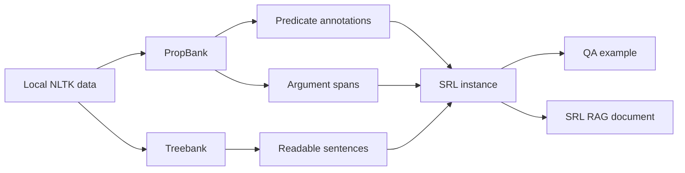

Explanation:

PropBank gives predicate-argument annotations. Treebank helps reconstruct readable context sentences. The project combines both to make QA examples and SRL-structured documents for retrieval.

## 5. PropBank Instance Transformation Flow

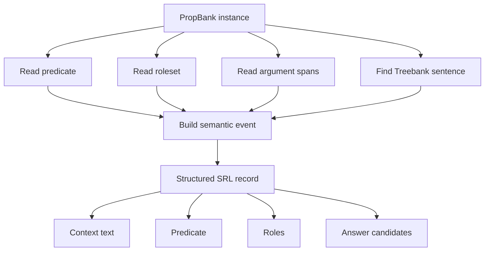

Explanation:

Each PropBank instance becomes a structured SRL record. That record contains the context text, predicate, roles, and answer candidates. This is the bridge between linguistic annotation and QA.

## 6. Semantic Role Flow

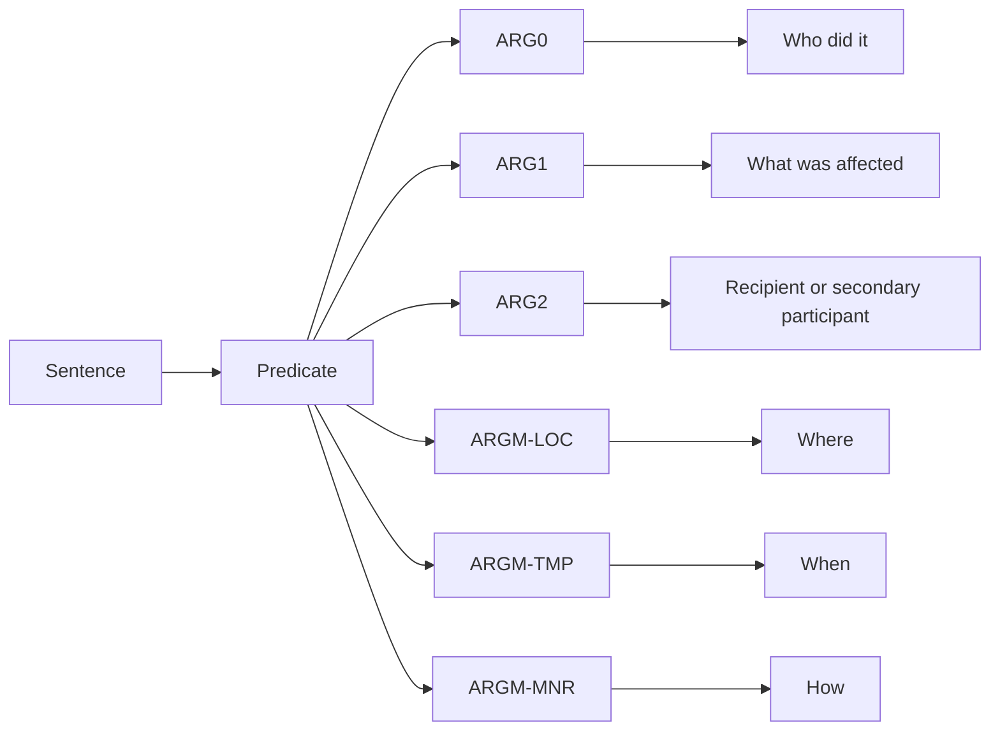

Explanation:

The predicate is the event. Roles describe participants and details around the event. For example, a "where" question usually maps to a location role such as `ARGM-LOC`.

## 7. Question To Role Mapping Flow

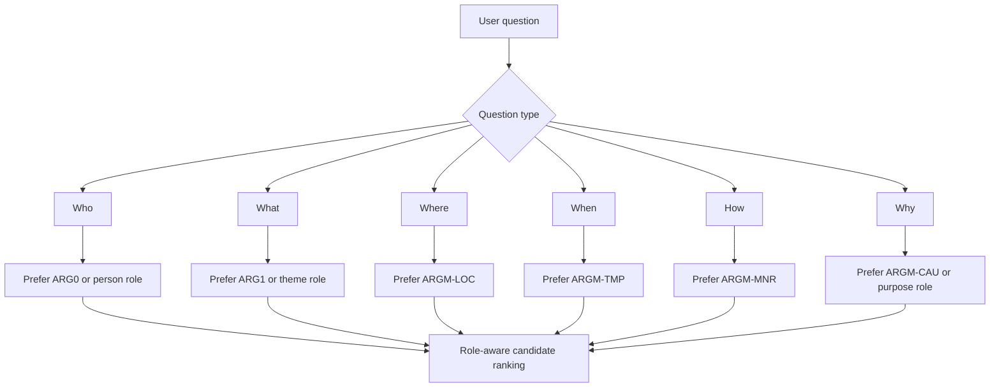

Explanation:

The project uses question words to estimate the expected semantic role. This helps the QA system select a better answer span. For example, "Where was the package delivered?" maps to `ARGM-LOC`, so the system prefers `to the office`.

## 8. Legacy PropQA-Net Architecture

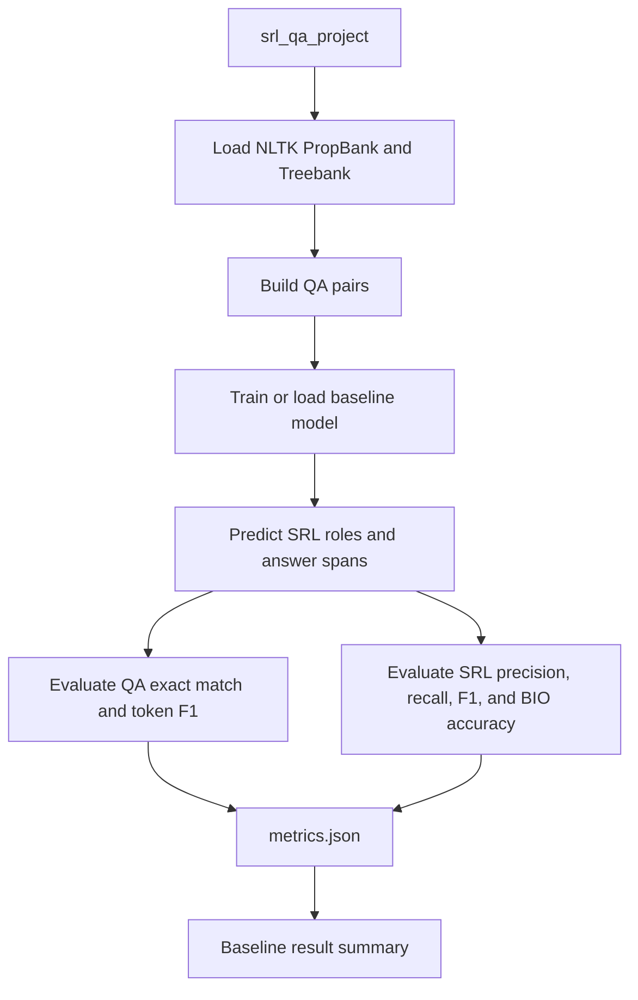

Explanation:

The legacy project is the baseline system. It uses PropBank and Treebank to create QA pairs, runs a baseline model, and evaluates both QA metrics and SRL metrics. This branch gives the strongest full-test baseline numbers.

## 9. Legacy Hybrid Benchmark Flow

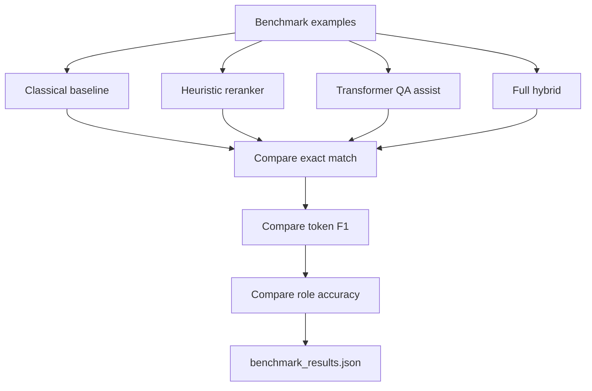

Explanation:

The benchmark track compares different answer selection methods. The role-aware heuristic and hybrid versions improve over the classical baseline on challenge-style examples because they choose spans that better match the expected semantic role.

## 10. RAISE SRL-QA Framework Architecture

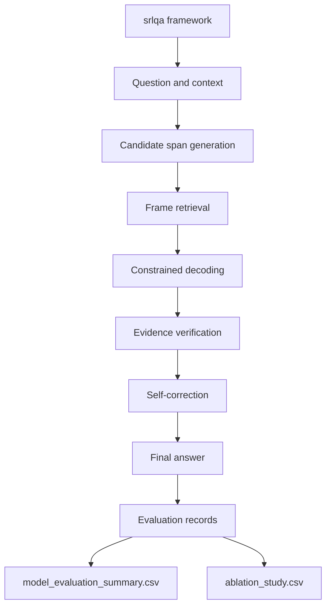

Explanation:

The RAISE framework adds more structure to the answer selection process. It uses frame retrieval, constrained decoding, verification, and optional correction. This is the innovation layer of the project.

## 11. RAISE Innovation Flow

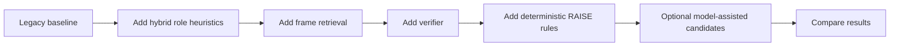

Explanation:

The RAISE pipeline improves the baseline by adding semantic controls. Instead of selecting only text overlap, it checks whether the answer candidate matches the expected role and the predicate frame.

## 12. SRL + RAG Streamlit App Architecture

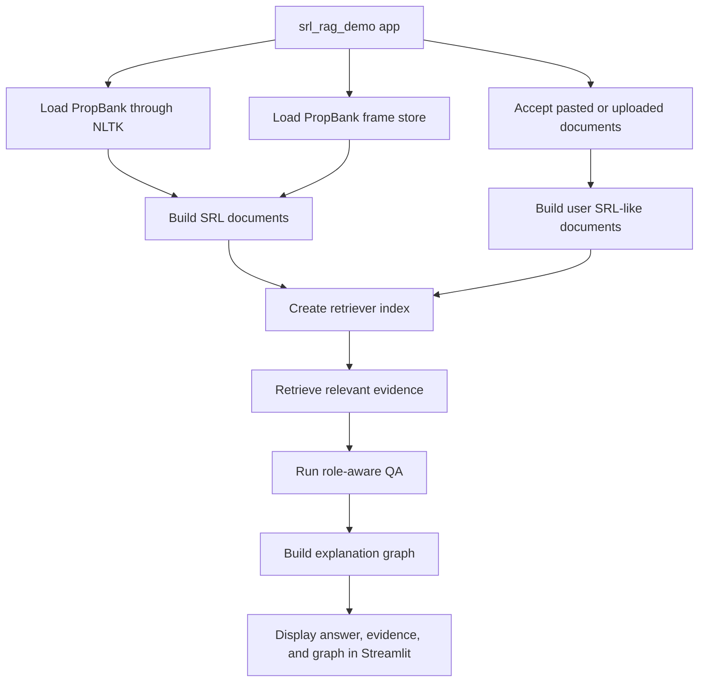

Explanation:

The Streamlit app is the final demo. It loads PropBank, builds structured documents, optionally adds user documents, retrieves evidence, answers questions, and visualizes the reasoning path.

## 13. Streamlit UI Flow

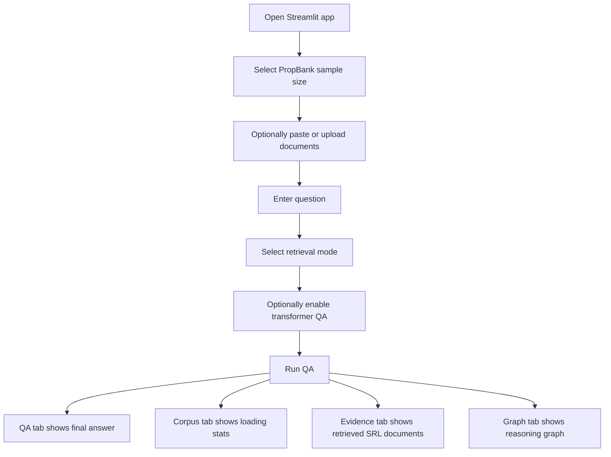

Explanation:

The app is designed for a live demo. The user controls the corpus size, extra documents, question, retrieval mode, and optional QA model. The results are split into tabs for easy explanation.

## 14. User Document Ingestion Flow

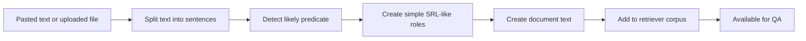

Explanation:

User documents do not have gold PropBank annotations. The demo therefore builds a simple SRL-like structure so they can still be retrieved and used for QA. PropBank documents remain the stronger structured evidence source.

## 15. Hybrid Retrieval Flow

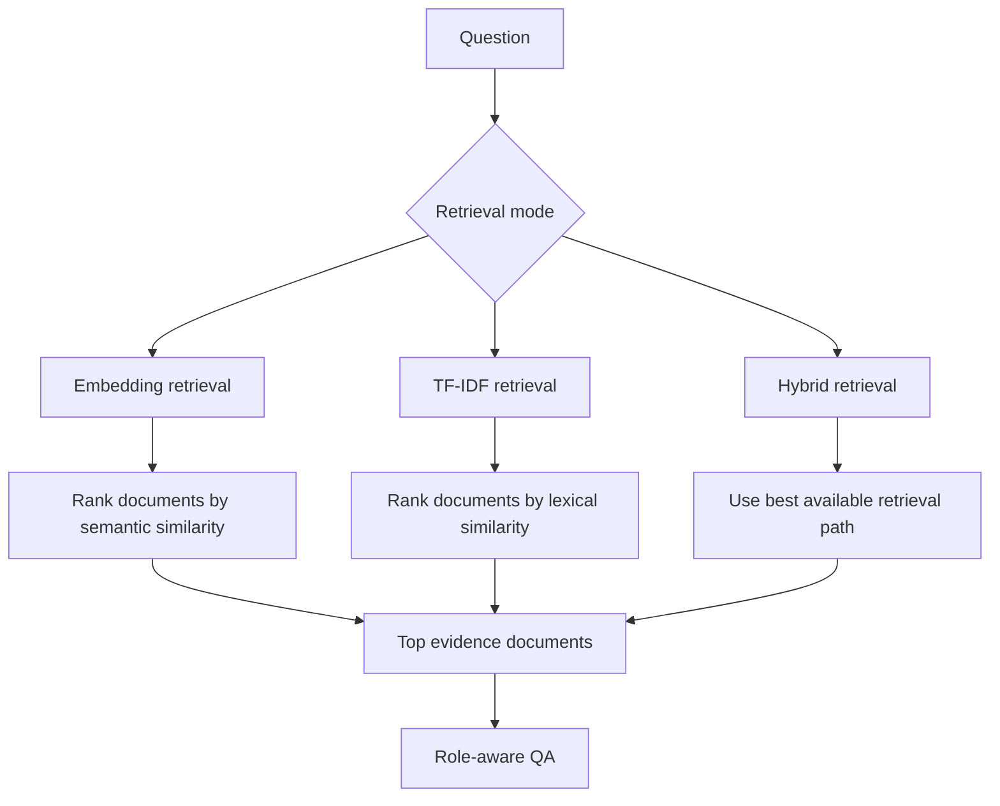

Explanation:

The demo tries to be practical. If sentence-transformer embeddings are available, semantic retrieval can be used. If they are not available, TF-IDF keeps the demo functional on a CPU-only machine.

## 16. Retrieval Document Structure

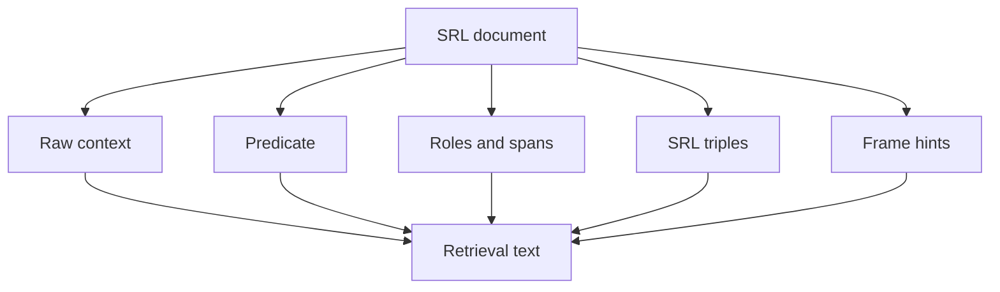

Explanation:

The retrieval text is not only raw context. It also includes structured SRL triples and frame hints. This makes retrieval more aware of event structure.

Example:

```text
delivered -> ARGM-LOC -> to the office
```

## 17. Role-Aware QA Flow

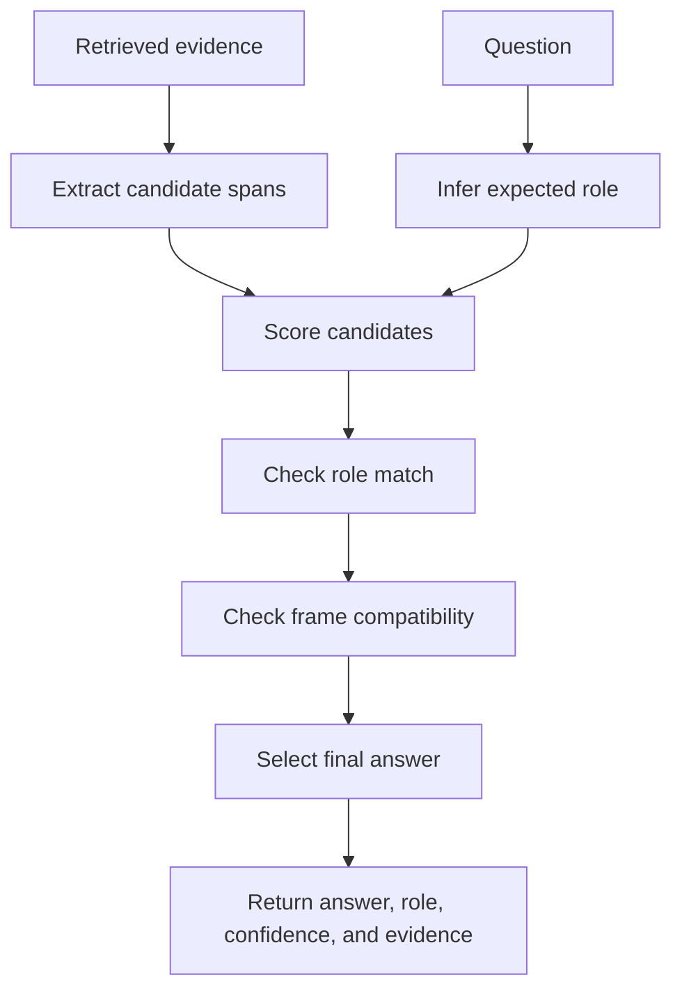

Explanation:

The QA system does not only ask which span overlaps with the question. It asks which span has the role expected by the question. This is why the system can choose `to the office` for a where question.

## 18. Optional Transformer QA Flow

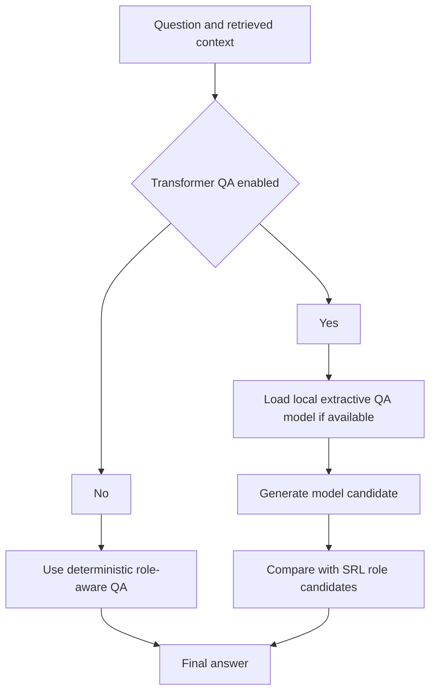

Explanation:

The final demo has an optional transformer QA path. The deterministic SRL path remains the default because it is faster and easier to explain. Transformer QA is optional because local model loading may be slower.

## 19. Explainable Graph QA Flow

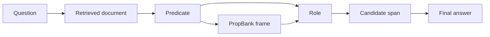

Explanation:

The graph is the explainability layer. It shows the route from the question to the retrieved document, then to the predicate, role, candidate span, and final answer.

## 20. Graph Node And Edge Design

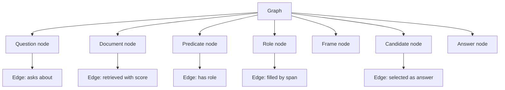

Explanation:

Each graph node has a meaning. Each graph edge explains a relationship. This makes the answer traceable instead of black-box.

## 21. End-To-End QA Sequence

```mermaid
sequenceDiagram
    participant User as User
    participant App as Streamlit App
    participant Loader as Corpus Loader
    participant Retriever as Retriever
    participant QA as QA Engine
    participant Graph as Graph Builder

    User->>App: Enter question
    App->>Loader: Load or reuse cached corpus
    Loader->>App: Return SRL documents
    App->>Retriever: Send question and documents
    Retriever->>App: Return top evidence
    App->>QA: Select role-aware answer
    QA->>App: Return answer and confidence
    App->>Graph: Build reasoning graph
    Graph->>App: Return graph nodes and edges
    App->>User: Show answer, evidence, and graph
```

Explanation:

This sequence shows the live demo behavior. The user asks a question, the retriever finds evidence, the QA engine selects an answer, and the graph builder explains the reasoning.

## 22. Evaluation Architecture

```mermaid
flowchart TD
    A["Predicted answer"] --> B["Exact match"]
    A --> C["Token precision"]
    A --> D["Token recall"]
    C --> E["Token F1"]
    D --> E
    F["Predicted role"] --> G["Role accuracy"]
    H["Predicted SRL tags"] --> I["SRL precision"]
    H --> J["SRL recall"]
    I --> K["SRL F1"]
    J --> K
    H --> L["BIO accuracy"]
    M["Runtime logs"] --> N["Latency"]
    M --> O["Confidence"]
```

Explanation:

The evaluation has two sides. QA metrics measure answer quality. SRL metrics measure role labeling quality. Runtime metrics measure demo practicality.

## 23. Metrics Decision Flow

```mermaid
flowchart TD
    A["What do we want to measure?"] --> B{"Answer correctness"}
    A --> C{"Role correctness"}
    A --> D{"SRL label quality"}
    A --> E{"Runtime practicality"}
    B --> B1["Exact Match"]
    B --> B2["Token F1"]
    C --> C1["Role Accuracy"]
    D --> D1["SRL Micro F1"]
    D --> D2["SRL Macro F1"]
    D --> D3["BIO Accuracy"]
    E --> E1["Latency"]
    E --> E2["Confidence"]
```

Explanation:

Use exact match when you need strict answer correctness. Use token F1 when partial overlap matters. Use role accuracy when explaining SRL behavior. Use latency for live demo performance.

## 24. Evaluation Result Flow

```mermaid
flowchart LR
    A["srl_qa_project metrics"] --> B["Full baseline claim"]
    C["srl_qa_project benchmarks"] --> D["Challenge split claim"]
    E["srlqa model summary"] --> F["Curated seed-suite claim"]
    G["srl_rag_demo smoke test"] --> H["Functional demo claim"]
    I["LoRA artifact summaries"] --> J["FAST_DEV experiment claim"]
```

Explanation:

Each metric source supports a different type of claim. The full baseline metrics should be used for full-test claims. The RAISE 100 percent result should be described only as a curated seed-suite result. The SRL + RAG demo should be described as a functional explainability demo.

## 25. Experiment Lifecycle Flow

```mermaid
flowchart TD
    A["Prepare data"] --> B["Build QA examples"]
    B --> C["Run baseline"]
    C --> D["Add role-aware improvements"]
    D --> E["Run comparison"]
    E --> F["Collect metrics"]
    F --> G["Create plots and tables"]
    G --> H["Write documentation"]
    H --> I["Run Streamlit demo"]
```

Explanation:

The project lifecycle moves from data preparation to baseline modeling, then to improved role-aware systems, metric collection, documentation, and finally demo presentation.

## 26. LoRA And QLoRA Experiment Flow

```mermaid
flowchart TD
    A["PropBank QA examples"] --> B["FAST_DEV subset"]
    B --> C["DistilBERT LoRA extractive QA"]
    B --> D["Tiny-GPT2 / Gemma 2B QLoRA scaffold"]
    C --> E["Fine-tuned test token F1"]
    D --> F["Generative test summary"]
    E --> G["Experimental evidence"]
    F --> G
    G --> H["Future work, not main demo path"]
```

Explanation:

The LoRA and QLoRA folders show experimental modeling work. They are useful as future-work evidence, but the final demo path is the SRL + RAG Streamlit app.

## 27. Documentation Architecture

```mermaid
flowchart TD
    A["Markdown docs"] --> B["PROJECT_EXPLANATION.md"]
    A --> C["PROJECT_UNDERSTANDING_GUIDE.md"]
    A --> D["KEY_TERMS_PROJECT_WORK.md"]
    A --> E["ARCHITECTURE_AND_EVALUATION_METRICS.md"]
    A --> F["ALL_EVALUATION_METRICS_COMPARISON.md"]
    A --> G["SURVEY_INNOVATION_IMPLEMENTATION_ANALYSIS.md"]
    A --> H["RUN_ALL_EXPERIMENTS_DEMO.md"]
    A --> I["PROJECT_FLOWS_AND_ARCHITECTURE_DIAGRAMS.md"]
    B --> J["Formal overview"]
    C --> K["Beginner explanation"]
    D --> L["Glossary and completed work"]
    E --> M["Architecture and metric definitions"]
    F --> N["All metric comparison tables"]
    G --> O["Survey to innovation to analysis story"]
    H --> P["Run commands"]
    I --> Q["Diagram-heavy explanation"]
```

Explanation:

The documentation is split by purpose. This file is the diagram-heavy explanation file. The other documents provide run commands, metrics, glossary terms, and project analysis.

## 28. Demo Presentation Flow

```mermaid
flowchart TD
    A["Start presentation"] --> B["Explain problem: QA needs explainability"]
    B --> C["Explain SRL and PropBank"]
    C --> D["Show project architecture"]
    D --> E["Show baseline metrics"]
    E --> F["Show role-aware improvement"]
    F --> G["Open SRL + RAG Streamlit app"]
    G --> H["Ask courier location question"]
    H --> I["Show answer: to the office"]
    I --> J["Show retrieved SRL evidence"]
    J --> K["Show explanation graph"]
    K --> L["End with limitations and future work"]
```

Explanation:

This is the recommended presentation route. Start with motivation, move to architecture and metrics, then show the live demo and graph explanation.

## 29. Example Reasoning Flow

```mermaid
flowchart LR
    A["Question: Where was the package delivered?"] --> B["Question type: WHERE"]
    B --> C["Expected role: ARGM-LOC"]
    C --> D["Predicate: delivered"]
    D --> E["Candidate span: to the office"]
    E --> F["Final answer: to the office"]
```

Explanation:

This example is the clearest demo case. A where question maps to a location role. The predicate is `delivered`. The location span is `to the office`, so that span becomes the final answer.

## 30. Baseline Failure And Improvement Flow

```mermaid
flowchart TD
    A["Question: Where was the package delivered?"] --> B["Classical baseline"]
    A --> C["Role-aware system"]
    B --> D["Selects large ARG1-like span"]
    D --> E["Wrong role and overlong answer"]
    C --> F["Maps question to ARGM-LOC"]
    F --> G["Selects location span"]
    G --> H["Correct answer: to the office"]
```

Explanation:

This flow explains why the role-aware system is better for the demo example. The baseline may over-select a longer phrase, while the role-aware system targets the location argument.

## 31. Deployment And Run Flow

```mermaid
flowchart TD
    A["Open terminal at project root"] --> B["Install needed libraries"]
    B --> C["Run smoke test"]
    C --> D["Start Streamlit app"]
    D --> E["Load corpus"]
    E --> F["Ask demo question"]
    F --> G["Inspect answer, evidence, and graph"]
```

Run command:

```powershell
streamlit run srl_rag_demo\app.py
```

Explanation:

For a demo, first run the smoke test if needed, then launch the Streamlit app. The app does not require an external API key.

## 32. Limitation And Future Work Flow

```mermaid
flowchart TD
    A["Current limitations"] --> B["Some results are small-suite metrics"]
    A --> C["LoRA and QLoRA are FAST_DEV artifacts"]
    A --> D["User documents use simple SRL-like parsing"]
    A --> E["Transformer QA can be slower"]
    B --> F["Future: run larger controlled benchmark"]
    C --> G["Future: full consistent model training"]
    D --> H["Future: add stronger SRL parser for arbitrary documents"]
    E --> I["Future: optimize model loading and caching"]
```

Explanation:

The strongest full-test result is from the legacy baseline. The RAISE scores are excellent but should be described as curated seed-suite scores. The live SRL + RAG demo is a functional explainability system, not a full benchmark replacement.

## 33. Final Architecture Summary

```mermaid
flowchart LR
    A["PropBank SRL"] --> B["Structured roles"]
    B --> C["QA candidates"]
    C --> D["Role-aware retrieval"]
    D --> E["Answer selection"]
    E --> F["Graph explanation"]
    F --> G["Streamlit demo"]
```

Final explanation:

The project connects linguistic structure with question answering. PropBank supplies semantic roles. The baseline system measures QA and SRL performance. The RAISE framework adds verification and role-aware improvements. The final Streamlit app turns the idea into an interactive SRL + RAG demo that retrieves evidence, answers questions, and shows graph-based reasoning.

