# Innovation Plan: Toward a 95% F1 Hybrid SRL-QA System

Date: 2026-04-07

Project: Hybrid Semantic Role Labeling Question Answering

Current local baseline:

| Metric | Current value | Source inside project |
|---|---:|---|
| QA exact match | 0.5184 | `results/metrics.json` |
| QA token F1 | 0.7612 | `results/metrics.json` |
| SRL micro F1 | 0.7133 | `results/metrics.json` |
| SRL macro F1 | 0.1619 | `results/metrics.json` |
| QA pairs | 23,007 | `results/data_statistics.json` |
| Usable PropBank instances | 9,073 | `results/data_statistics.json` |

## Executive Goal

The innovation target is to upgrade the project from a baseline-plus-hybrid demo into a research-level SRL-QA system that can push local token-F1 toward 95% under strict evaluation, while staying explainable and locally runnable.

The most realistic version of the target is:

| Target | Feasibility | Notes |
|---|---|---|
| 95% token-F1 on a curated local challenge suite | High if the suite is expanded and hard-negative tuned | Useful for demo, but must be labeled as challenge-suite performance |
| 90-95% token-F1 on the current PropBank-derived local split | Medium | Requires retraining, better data, constrained decoding, and an ensemble/verifier |
| 95% official SRL F1 on public CoNLL/OntoNotes | Very high risk | This may exceed published SOTA territory and cannot be claimed without official scorer validation |
| Beat existing systems on explainability and UI integration | High | The project can beat many systems as an end-to-end research artifact: answer, role, evidence, reasoning, app, plots, PDFs |

Do not claim 95% F1 until the project produces it under a frozen test split and saved benchmark script. The plan below is designed to make 95% plausible, not to assume it.

## Latest Research Signals Used

| Year | Work | Key idea | How it maps to this project |
|---|---|---|---|
| 2025 | [LLMs Can Also Do Well! Breaking Barriers in Semantic Role Labeling via Large Language Models](https://aclanthology.org/2025.findings-acl.1189/) | Uses retrieval-augmented generation and self-correction to bridge the LLM vs encoder-decoder gap in SRL and reports SOTA results on SRL benchmarks | Add PropBank frame retrieval, role descriptions, and iterative self-correction to the hybrid system |
| 2026 | [Effective QA-driven Annotation of Predicate-Argument Relations Across Languages](https://arxiv.org/abs/2602.22865) | Uses QA-SRL as a transferable natural-language interface and generates aligned training data through constrained translation and word alignment | Add data expansion through QA-SRL style projection and alignment, even if initially English-only |
| 2025 | [QA-Noun: Representing Nominal Semantics via Natural Language Question-Answer Pairs](https://arxiv.org/abs/2511.12504) | Extends QA-based semantic decomposition to noun-centered semantics and complements verbal QA-SRL | Add nominal predicate and entity-role questions to increase semantic coverage |
| 2025 | [Are LLMs Good for Semantic Role Labeling via Question Answering?](https://aclanthology.org/2025.ijcnlp-srw.21.pdf) | Shows prompting-only LLMs remain below supervised QA-SRL systems and identifies span imprecision, inaccurate extraction, and formatting deviation errors | Avoid pure prompting; use supervised fine-tuning, constrained decoding, and verifier-based correction |
| 2025 | [Emergence and Localisation of Semantic Role Circuits in LLMs](https://arxiv.org/abs/2511.20910) | Studies how LLMs encode semantic role structure using role-cross minimal pairs and temporal analysis | Add role-confusion diagnostics and minimal-pair challenge tests |
| 2025 | [On the Role of Semantic Proto-roles in Semantic Analysis: What do LLMs know about agency?](https://aclanthology.org/2025.findings-acl.623.pdf) | Uses proto-role theory to test event-structure reasoning and agency | Add proto-role auxiliary features for difficult ARG0/ARG1 and agency/patient distinctions |

## Proposed Innovation Name

Name: RAISE-SRL-QA

Expansion: Retrieval-Augmented, Iteratively Self-correcting, Explainable Semantic Role Labeling Question Answering

Core claim:

RAISE-SRL-QA improves the current hybrid system by combining a stronger supervised SRL-QA model, PropBank frame retrieval, constrained answer decoding, LLM-style self-correction, teacher-student distillation, and a verifier ensemble.

## Architecture Vision

```mermaid
flowchart LR
    A["User context + question"] --> B["Question intent parser"]
    B --> C["Predicate detector + normalizer"]
    C --> D["PropBank frame retriever"]
    D --> E["Role definition and exemplar pack"]
    A --> F["Fine-tuned MRC SRL-QA encoder"]
    E --> F
    F --> G["Candidate span generator"]
    G --> H["Constrained decoder"]
    H --> I["Verifier ensemble"]
    I --> J["Self-correction loop"]
    J --> K["Final answer + role + evidence + confidence"]
    K --> L["Streamlit UI + benchmark reports"]
```

## Main Innovations to Add

| Rank | Innovation | Expected gain | Difficulty | Practical implementation |
|---:|---|---:|---|---|
| 1 | Fine-tuned MRC SRL-QA encoder | Very high | Medium | Train DeBERTa-v3-large or RoBERTa-large in question-answer format |
| 2 | PropBank frame retrieval | High | Medium | Retrieve roleset definitions and examples for each predicate |
| 3 | Constrained answer decoder | High | Medium | Enforce contiguous span boundaries, frame-compatible roles, and no invalid answer format |
| 4 | Self-correction verifier | High | Medium-high | Recheck predicted answer against role constraints and candidate spans |
| 5 | Hard-negative mining | High | Medium | Train on near-miss spans for WHY, HOW, WHERE, and ARG2 |
| 6 | Teacher-student distillation | High | Medium-high | Use strong teacher predictions as soft labels after validation |
| 7 | Multi-task role and span learning | Medium-high | Medium | Jointly predict role, start, end, predicate, and answerability |
| 8 | Nominal QA extension | Medium | Medium | Add QA-Noun style noun-centered questions |
| 9 | Proto-role auxiliary labels | Medium | Medium-high | Add agency, volition, affectedness, and change-of-state signals |
| 10 | Calibration and ensemble voting | Medium | Low-medium | Combine baseline, fine-tuned MRC, heuristic reranker, and verifier confidence |

## Practical Implementation Plan

### Phase 1: Build a serious evaluation foundation

Goal: make every future improvement measurable and defensible.

Tasks:

- Freeze the current test split and save a `results/eval_manifest.json` file.
- Add a larger `data/challenge_suite_v2.json` with at least 300 examples across WHO, WHAT, WHEN, WHERE, HOW, WHY, TO-WHOM, and nominal questions.
- Add adversarial minimal pairs such as "The company hired Rahul" versus "Rahul hired the company".
- Add span-boundary traps such as "in the office at noon" where the correct answer must not absorb the time phrase.
- Add no-answer or unanswerable cases to reduce overconfident guessing.
- Add official scoring functions for token-F1, exact match, role accuracy, calibration error, and latency.
- Store every run in `results/experiments/<timestamp>/`.

Files to add:

- `evaluation/offline_eval.py`
- `evaluation/span_metrics.py`
- `evaluation/calibration.py`
- `data/challenge_suite_v2.json`
- `docs/EVALUATION_PROTOCOL.md`

Exit criteria:

- Evaluation can be run with `python main.py --mode benchmark --suite challenge_v2`.
- Results include confidence intervals using bootstrap resampling.
- No model is allowed to tune directly on the frozen test examples.

### Phase 2: Train a stronger MRC-style SRL-QA model

Goal: replace the current weak learned span predictor with a modern supervised reader while keeping the current baseline as a comparison.

Approach:

- Convert every example into an MRC format: `[question] [SEP] [predicate] [SEP] [context]`.
- Add predicate markers around the predicate token in context.
- Add special role hints such as `[ROLE=ARGM-LOC]` when the question parser is confident.
- Fine-tune `microsoft/deberta-v3-base` first, then try `microsoft/deberta-v3-large` if hardware permits.
- Train start-token, end-token, role-label, answerability, and boundary-quality heads together.
- Use class-balanced sampling so WHY, HOW, WHERE, and ARG2 examples appear more often.

Files to add:

- `models/mrc_srl_qa.py`
- `training/train_mrc_srl.py`
- `training/collators.py`
- `training/losses.py`
- `data/convert_to_mrc.py`

Target milestones:

| Milestone | Target |
|---|---:|
| MRC base token-F1 | 0.84 |
| MRC base role accuracy | 0.82 |
| MRC large token-F1 | 0.88 |
| MRC large role accuracy | 0.86 |

Why this helps:

The current system has strong logic but weak learned span precision. A fine-tuned MRC model can directly optimize answer span boundaries, which is the largest practical path toward 95% token-F1.

### Phase 3: Add PropBank frame retrieval

Goal: use external linguistic knowledge during inference, following the 2025 RAG plus self-correction direction for SRL.

Approach:

- Build a local index of PropBank framesets, roleset descriptions, examples, and role inventories.
- At inference time, retrieve the frame for the normalized predicate.
- Add retrieved role descriptions to the reranker input.
- Penalize candidates whose predicted role is not compatible with the retrieved predicate frame.
- Use retrieved examples as few-shot role evidence for the verifier.

Files to add:

- `retrieval/propbank_index.py`
- `retrieval/frame_retriever.py`
- `retrieval/frame_store.json`
- `retrieval/build_frame_index.py`

Target milestones:

| Milestone | Target |
|---|---:|
| Predicate frame retrieval accuracy | 0.90 |
| Role compatibility error reduction | 25% |
| Token-F1 after retrieval | 0.89-0.91 |

Why this helps:

The 2025 ACL SRL LLM work highlights retrieval of predicate and argument structure descriptions as a key mechanism. This project can implement the same idea locally with PropBank frames instead of relying entirely on a remote model.

### Phase 4: Add constrained span decoding

Goal: remove avoidable boundary errors and invalid outputs.

Approach:

- Generate top-k start/end spans from the MRC model.
- Reject spans crossing predicate markers unless the role explicitly allows predicate inclusion.
- Reject spans that include both location and temporal modifiers when the question asks only WHERE or WHEN.
- Penalize spans that are too long compared to role-specific length priors.
- Enforce role-specific boundary rules such as causal spans beginning at "because", "due to", or "as a result of".
- Keep only spans that occur exactly in the input context.

Files to add:

- `decoding/constrained_decoder.py`
- `decoding/span_rules.py`
- `decoding/role_priors.py`

Target milestones:

| Milestone | Target |
|---|---:|
| Long-span error reduction | 40% |
| WHERE/WHEN boundary F1 | 0.92 |
| Overall token-F1 after constrained decoding | 0.91-0.93 |

Why this helps:

The 2025 QA-SRL LLM evaluation found imprecise spans as a common failure mode. Constrained decoding directly targets that problem.

### Phase 5: Add self-correction verifier

Goal: add a second pass that catches inconsistent role tags, wrong spans, and role-question mismatches.

Approach:

- Create a verifier that receives context, question, predicate, candidate answer, candidate role, and retrieved frame knowledge.
- Ask the verifier to score whether the candidate span answers the question and matches the semantic role.
- Use a small local sequence-classification model first, then optionally use an instruction model for explanation only.
- Run correction only when confidence is below a threshold or when two candidates are close.
- Never allow the verifier to invent a new answer not found in candidate spans.

Files to add:

- `verification/span_verifier.py`
- `verification/self_correction.py`
- `verification/verifier_training_data.py`

Target milestones:

| Milestone | Target |
|---|---:|
| Verifier accuracy on candidate pairs | 0.90 |
| Role mismatch reduction | 30% |
| Token-F1 after verifier | 0.93 |

Why this helps:

The 2025 ACL SRL LLM paper uses self-correction to address inconsistent SRL outputs. This project can implement a safer version that corrects only among extracted evidence candidates.

### Phase 6: Add teacher-student distillation

Goal: use a stronger teacher to create high-quality additional training signals without trusting raw generated answers blindly.

Approach:

- Use the current hybrid system, the new MRC model, and an optional strong teacher model to produce candidate labels.
- Keep only labels that pass exact span checks, role-frame compatibility checks, and verifier confidence thresholds.
- Train the student model using hard labels from gold data and soft labels from high-confidence teacher outputs.
- Use disagreement cases for manual review and challenge-suite expansion.

Files to add:

- `distillation/teacher_runner.py`
- `distillation/filter_teacher_labels.py`
- `distillation/train_student.py`
- `data/silver/`

Target milestones:

| Milestone | Target |
|---|---:|
| Accepted silver-label precision | 0.95 |
| Data volume increase | 2x-5x |
| Token-F1 after distillation | 0.94 |

Why this helps:

95% F1 is unlikely with the current 23,007 QA pairs alone. Distillation and strict filtering can expand training coverage without sacrificing too much label quality.

### Phase 7: Add hard-negative mining

Goal: train the model to distinguish near-correct spans from exact gold spans.

Approach:

- For each gold answer, create negative candidates that overlap but include extra words.
- Add wrong-role candidates from the same sentence.
- Add competing adjunct candidates such as "to the office" versus "at noon".
- Add transfer-event negatives such as item versus recipient.
- Train a pairwise ranking loss: gold span must outrank near-miss candidates.

Files to add:

- `training/hard_negative_mining.py`
- `training/ranking_loss.py`
- `analysis/hard_negative_report.py`

Target milestones:

| Milestone | Target |
|---|---:|
| Near-miss boundary error reduction | 50% |
| ARG2 token-F1 | 0.90 |
| WHY/HOW/WHERE token-F1 | 0.92 |

Why this helps:

The current system frequently improves roles but still needs sharper span boundaries. Hard negatives directly teach exact boundary behavior.

### Phase 8: Add nominal semantics and QA-Noun style examples

Goal: increase coverage beyond verbal predicates.

Approach:

- Add noun-centered question templates for event nouns, relational nouns, and implicit roles.
- Add a separate nominal predicate detector.
- Add a UI toggle: "verbal SRL only" versus "verbal + nominal semantics".
- Evaluate nominal questions separately so they do not inflate verbal SRL metrics.

Files to add:

- `nominal/qa_noun_templates.py`
- `nominal/nominal_detector.py`
- `nominal/nominal_eval.py`

Target milestones:

| Milestone | Target |
|---|---:|
| Nominal challenge examples | 100+ |
| Nominal token-F1 | 0.80 initially |
| Combined semantic coverage | 25% more answerable event/entity questions |

Why this helps:

The 2025 QA-Noun work shows that noun-centered QA pairs complement verbal QA-SRL and produce finer-grained semantic decomposition.

### Phase 9: Add proto-role auxiliary reasoning

Goal: reduce role confusion in agent/patient and event-structure cases.

Approach:

- Add auxiliary binary labels such as instigation, volition, sentience, change of state, and affectedness where possible.
- Use these labels as auxiliary prediction heads.
- Add minimal pairs that flip agency and patient roles.
- Use proto-role predictions as reranker features.

Files to add:

- `proto_roles/proto_role_features.py`
- `proto_roles/minimal_pair_suite.py`
- `proto_roles/proto_role_aux_loss.py`

Target milestones:

| Milestone | Target |
|---|---:|
| ARG0/ARG1 role-confusion reduction | 20% |
| Minimal-pair accuracy | 0.90 |
| Token-F1 lift | 0.5-1.0 point |

Why this helps:

Recent 2025 work on semantic proto-roles and LLM agency reasoning suggests that role confusion is not only a span problem; it is also an event-reasoning problem.

### Phase 10: Add calibration, ensemble voting, and leaderboard reporting

Goal: make the system reliable enough to claim high F1 only under correct conditions.

Approach:

- Calibrate confidence with temperature scaling on the validation split.
- Combine four signals: baseline PropQA-Net, MRC model, hybrid heuristics, and verifier.
- Use abstention when confidence is low.
- Add a leaderboard report comparing current baseline, hybrid, MRC, MRC plus retrieval, MRC plus verifier, and full RAISE-SRL-QA.

Files to add:

- `ensemble/weighted_voter.py`
- `ensemble/calibrated_confidence.py`
- `reports/leaderboard.py`

Target milestones:

| Milestone | Target |
|---|---:|
| Expected calibration error | below 0.05 |
| Validation token-F1 | 0.94 |
| Frozen local test token-F1 | 0.95 target |

Why this helps:

Beating existing systems requires not only high scores but also stable, reproducible, well-reported evaluation.

## Full 95% F1 Roadmap

| Stage | System version | Expected token-F1 | Main action |
|---:|---|---:|---|
| 0 | Current baseline | 0.7612 | Keep as reference |
| 1 | Current hybrid plus challenge fixes | 0.78-0.82 | Improve role heuristics and evaluation |
| 2 | Fine-tuned MRC encoder | 0.84-0.88 | Train DeBERTa/RoBERTa MRC model |
| 3 | MRC plus PropBank retrieval | 0.89-0.91 | Add frameset descriptions and role constraints |
| 4 | MRC plus constrained decoding | 0.91-0.93 | Fix boundary and invalid span errors |
| 5 | Verifier plus self-correction | 0.92-0.94 | Add evidence-based correction loop |
| 6 | Distillation plus hard-negative mining | 0.94-0.95 | Expand high-confidence data and train near-miss discrimination |
| 7 | Ensemble plus calibration | 0.95 target | Combine all signals and freeze final scorer |

## Minimum Viable Innovation Package

If time is limited, implement this subset first:

- Fine-tune one MRC SRL-QA model.
- Add PropBank frame retrieval.
- Add constrained span decoding.
- Add self-correction verifier.
- Add a 300-example challenge suite.
- Add a leaderboard table and ablation plots to the Streamlit app.

This subset is the strongest practical path to a measurable F1 jump without turning the project into a full PhD-scale system.

## Experiments Needed to Prove the Claim

| Experiment | Purpose | Success condition |
|---|---|---|
| Baseline vs MRC | Prove stronger model helps | MRC improves token-F1 by at least 8 points |
| MRC vs MRC plus retrieval | Prove PropBank RAG helps | Retrieval reduces role mismatch errors |
| MRC vs constrained decoder | Prove boundary correction helps | Long-span errors drop by at least 40% |
| Verifier ablation | Prove self-correction helps | Verifier improves low-confidence examples |
| Distillation ablation | Prove silver labels help | Student improves without lowering precision |
| Hard-negative ablation | Prove near-miss training helps | WHY/HOW/WHERE/ARG2 improve most |
| Calibration experiment | Prove confidence is meaningful | ECE below 0.05 |
| Challenge-suite stress test | Prove robustness | 90%+ F1 on all major question types |

## How to Beat Existing Systems Responsibly

The project can beat existing systems in three different ways:

| Claim type | Practical route | Evidence required |
|---|---|---|
| Beat current repo baseline | Implement roadmap stages 1-5 | Local benchmark and frozen test split |
| Beat prompting-only LLM QA-SRL | Use supervised MRC plus constraints | Compare to published prompting-only F1 and run a local prompt baseline |
| Beat many demo systems on explainability | Show answer, role, evidence, reasoning, confidence, and documentation | Streamlit app demo and PDF reports |
| Beat public SOTA | Much harder; requires official datasets and scorer | CoNLL/OntoNotes official evaluation, reproducible scripts, no leakage |

Be careful: "beat existing systems" should not be claimed globally until the system is evaluated with the same benchmark, same split, and same scorer as the compared system.

## Concrete File-Level Implementation Map

| Area | New files |
|---|---|
| MRC model | `models/mrc_srl_qa.py`, `training/train_mrc_srl.py`, `training/collators.py` |
| Retrieval | `retrieval/propbank_index.py`, `retrieval/frame_retriever.py`, `retrieval/build_frame_index.py` |
| Decoding | `decoding/constrained_decoder.py`, `decoding/span_rules.py`, `decoding/role_priors.py` |
| Verification | `verification/span_verifier.py`, `verification/self_correction.py` |
| Distillation | `distillation/teacher_runner.py`, `distillation/filter_teacher_labels.py`, `distillation/train_student.py` |
| Hard negatives | `training/hard_negative_mining.py`, `training/ranking_loss.py` |
| Nominal semantics | `nominal/qa_noun_templates.py`, `nominal/nominal_detector.py` |
| Proto-role analysis | `proto_roles/proto_role_features.py`, `proto_roles/minimal_pair_suite.py` |
| Evaluation | `evaluation/offline_eval.py`, `evaluation/span_metrics.py`, `evaluation/calibration.py` |
| Reports | `reports/leaderboard.py`, `docs/EVALUATION_PROTOCOL.md` |

## Suggested Training Recipe

Use this order:

1. Train `deberta-v3-base` MRC model for fast iteration.
2. Add weighted loss for rare roles.
3. Add hard-negative span pairs.
4. Add PropBank role retrieval as input text.
5. Add constrained decoding during evaluation.
6. Train a verifier on gold versus near-miss candidates.
7. Generate silver labels only from high-confidence agreement between MRC, hybrid heuristics, and verifier.
8. Train a distilled student.
9. Ensemble the best checkpoint with the verifier.
10. Freeze the test split and run final benchmark.

## Metrics to Track

| Metric | Why it matters |
|---|---|
| Token-F1 | Main 95% target |
| Exact match | Strict span correctness |
| Role accuracy | Whether the answer is semantically correct |
| Predicate accuracy | Whether the answer is tied to the right event |
| Boundary error rate | Whether spans are too long or too short |
| Rare-role F1 | Whether ARG2, WHY, HOW, WHERE improve |
| Calibration error | Whether confidence can be trusted |
| Latency | Whether the app remains practical |
| Error category distribution | Whether improvements are real or just shifted errors |

## 95% F1 Risk Register

| Risk | Why it matters | Mitigation |
|---|---|---|
| Dataset too small | 23,007 QA pairs may not cover enough patterns | Use QA-SRL data, silver labels, and challenge expansion |
| Overfitting challenge suite | 95% on curated data may not generalize | Freeze hidden test suite and report public-split results separately |
| Boundary errors | Span F1 suffers from one extra word | Add constrained decoding and hard-negative mining |
| Role imbalance | Rare roles remain weak | Use weighted sampling and rare-role augmentation |
| LLM hallucination | Free-form correction can invent answers | Restrict verifier to candidate spans only |
| Latency | Full hybrid may be too slow for UI | Cache retrieval, use verifier only on uncertain cases, distill final model |
| Unfair SOTA comparison | Different datasets and metrics invalidate claims | Use official scorers and clearly label every benchmark |

## Final Recommendation

The best innovation path is not to make the project a pure LLM chatbot. The strongest and most defensible approach is a neuro-symbolic SRL-QA system:

- Neural MRC model for strong span prediction.
- PropBank retrieval for explicit role knowledge.
- Constrained decoding for exact boundary control.
- Self-correction verifier for consistency.
- Teacher-student distillation for data expansion.
- Streamlit dashboard for explainability and evidence.

This combination directly follows the strongest 2025 research signal: retrieval plus self-correction can close the LLM-SRL gap. It also incorporates the 2026 QA-SRL direction: QA-driven semantic structures are portable, alignable, and useful as natural-language interfaces.

If implemented carefully, the project can plausibly reach 95% token-F1 on a well-defined local SRL-QA benchmark and become much more competitive as a research-level system. A global SOTA claim should only be made after official benchmark validation.
